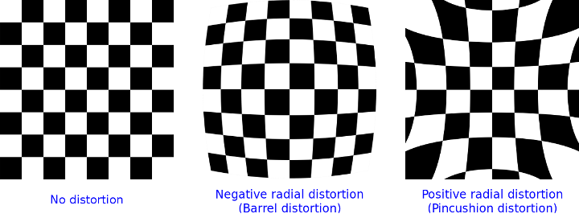
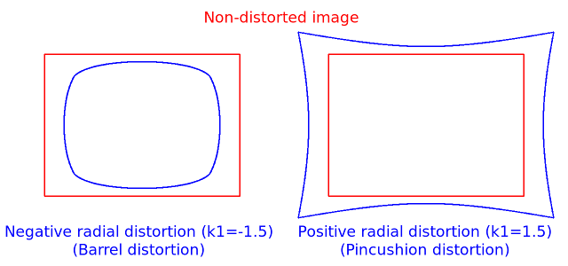

# OpenCV Calibration-Detailed Description

## 前言
看了众多关于针孔相机模型的介绍和相关矩阵变换的推导Blog，回头发现在OpenCV同样有相关内容，并且描述的相当清晰。于是工作之便，作以翻译分享。

翻译采用了一段英文原文接一段翻译的形式，并且部分名词保留了英文并未翻译，以尽可能保留原味。

## 坐标系变换

The functions in this section use a so-called pinhole camera model. The view of a scene is obtained by projecting a scene's 3D point $P_w$ into the image plane using a perspective transformation which forms the corresponding pixel $p$. Both $P_w$ and $p$ are represented in homogeneous coordinates, i.e. as 3D and 2D homogeneous vector respectively. You will find a brief introduction to projective geometry, homogeneous vectors and homogeneous transformations at the end of this section's introduction. For more succinct notation, we often drop the 'homogeneous' and say vector instead of homogeneous vector.

本章节中的函数使用了pinhole camera model。一种场景是使用perspective transformation，将三维空间的坐标点$P_w$ project到image plane的对应点$p$。$P_w$ 与$p$均使用homogeneous coordinates表示，则分别对应3D和2D的homogeneous vector。在本节介绍的最后，你会看到关于projective geometry, homogeneous vectors 和 homogeneous transformations的简要介绍。为了更简要的表示，我们省略'homogeneous'直接说vector而不是homogeneous vector。

The distortion-free projective transformation given by a pinhole camera model is shown below.

在pinhole camera model中，distortion-free projective transformation如下所示。

$$[s \; p = A \begin{bmatrix} R|t \end{bmatrix} P_w],$$

where $P_w$ is a 3D point expressed with respect to the world coordinate system, $p$ is a 2D pixel in the image plane, $A$ is the intrinsic camera matrix, $R$ and $t$ are the rotation and translation that describe the change of coordinates from world to camera coordinate systems (or camera frame) and $s$ is the projective transformation's arbitrary scaling and not part of the camera model.

其中，$P_w$表示world coordinate system中的3D点。$p$是image plane中的2D点。$A$是intrinsic camera matrix。$R$和$t$分别表示坐标点从world coordinate systems至camera coordinate system（或被称为camera frame）的rotation和translation。$s$表示任意scaling的projective transformation，不属于camera model。

The intrinsic camera matrix $A$ (notation used as in Zhengyou Zhang and also generally notated as $K$) projects 3D points given in the camera coordinate system to 2D pixel coordinates, i.e.

intrinsic camera matrix $A$（在Zhengyou Zhang中被使用，也被记为$K$）将camera coordinate system中的3D点投影至2D像素坐标。

$$p = A P_c.$$

The camera matrix $A$ is composed of the focal lengths $f_x$ and $f_y$, which are expressed in pixel units, and the principal point $(c_x, c_y)$, that is usually close to the image center:

camera matrix $A$包括：focal length $f_x$和$f_y$，以像素为单位。principal point $(c_x, c_y)$通常表示为图像中心。

$$A =  \begin{bmatrix}{f_x}&{0}&{c_x}\\{0}&{f_y}&{c_y}\\{0}&{0}&{1}\end{bmatrix},$$

and thus

$$s  \begin{bmatrix}{u}\\{v}\\{1}\end{bmatrix} = \begin{bmatrix}{f_x}&{0}&{c_x}\\{0}&{f_y}&{c_y}\\{0}&{0}&{1}\end{bmatrix} \begin{bmatrix}{X_c}\\{Y_c}\\{Z_c}\end{bmatrix}.$$

The matrix of intrinsic parameters does not depend on the scene viewed. So, once estimated, it can be re-used as long as the focal length is fixed (in case of a zoom lens). Thus, if an image from the camera is scaled by a factor, all of these parameters need to be scaled (multiplied/divided, respectively) by the same factor.

camera matrix中的参数不由scene viewed决定。因此，一次estimated，只要focal length固定（除zoom lens）便可以一直使用。因此如果图像发生scale，所有的参数同样需要scaled（对应multiplied或者divided。）相同的factor即可。

The joint rotation-translation matrix $[R|t]$ is the matrix product of a projective transformation and a homogeneous transformation. The 3-by-4 projective transformation maps 3D points represented in camera coordinates to 2D poins in the image plane and represented in normalized camera coordinates $x' = X_c / Z_c$ and $y' = Y_c / Z_c$:

joint rotation-translation matrix $[R|t]$ 是projective transformation和homogeneous transformation的矩阵乘法。其中3-by-4 大小的projective transformation将camera coordinates的一个3D点map到image plane的2D点。并使用normalized camera coordinates表示$x' = X_c / Z_c$， $y' = Y_c / Z_c$。

$$ Z_c \begin{bmatrix} x' \\ y' \\ 1\end{bmatrix} = 
\begin{bmatrix}1 & 0 & 0 & 0 \\0 & 1 & 0 & 0 \\0 & 0 & 1 & 0\end{bmatrix}
\begin{bmatrix} X_c \\ Y_c \\ Z_c \\ 1\end{bmatrix}. $$

The homogeneous transformation is encoded by the extrinsic parameters $R$ and $t$ and represents the change of basis from world coordinate system $w$ to the camera coordinate sytem $c$. Thus, given the representation of the point $P$ in world coordinates, $P_w$, we obtain $P$'s representation in the camera coordinate system, $P_c$, by

homogeneous transformation包括extrinsic parameters $R$ 和 $t$，它表示basis从world coordinate system $w$到camera coordinate sytem $c$。即给出点$P$在world coordinates的坐标$P_w$，通过该矩阵计算可与获得点$P$在camera coordinate的对应点$P_c$。

$$[P_c = \begin{bmatrix} R & t \\ 0 & 1 \end{bmatrix} P_w],$$

This homogeneous transformation is composed out of $R$, a 3-by-3 rotation matrix, and $t$, a 3-by-1 translation vector:

该homogeneous transformation由3-by-3 rotation matrix$R$和 3-by-1 translation vector $t$组成。

$$\begin{bmatrix} R & t \\ 0 & 1 \end{bmatrix} = 
\begin{bmatrix}r_{11} & r_{12} & r_{13} & t_x 
\\r_{21} & r_{22} & r_{23} & t_y 
\\r_{31} & r_{32} & r_{33} & t_z 
\\0 & 0 & 0 & 1\end{bmatrix},$$

and therefore

$$\begin{bmatrix} X_c \\ Y_c \\ Z_c \\ 1
\end{bmatrix} = \begin{bmatrix}
r_{11} & r_{12} & r_{13} & t_x \\
r_{21} & r_{22} & r_{23} & t_y \\
r_{31} & r_{32} & r_{33} & t_z \\
0 & 0 & 0 & 1
\end{bmatrix} \begin{bmatrix} X_w \\ Y_w \\ Z_w \\ 1 \end{bmatrix}.$$

Combining the projective transformation and the homogeneous transformation, we obtain the projective transformation that maps 3D points in world coordinates into 2D points in the image plane and in normalized camera coordinates:

合并projective transformation 和 homogeneous transformation，我们可以获得projective transformation，使用该矩阵可以将world coordinates的3d点map到image plane 2D点或 normalized camera coordinate。

$$Z_c \begin{bmatrix} x' \\ y' \\ 1\end{bmatrix} = 
\begin{bmatrix} R|t \end{bmatrix} \begin{bmatrix}X_w \\ Y_w \\ Z_w \\ 1\end{bmatrix} = 
\begin{bmatrix}
r_{11} & r_{12} & r_{13} & t_x \\
r_{21} & r_{22} & r_{23} & t_y \\
r_{31} & r_{32} & r_{33} & t_z
\end{bmatrix}
\begin{bmatrix} X_w \\ Y_w \\ Z_w \\ 1 \end{bmatrix},$$

with $x' = X_c / Z_c$ and $y' = Y_c / Z_c$. Putting the equations for instrincs and extrinsics together, we can write out
$ s \; p = A \begin{bmatrix} R|t \end{bmatrix} P_w $ as

使用$x' = X_c / Z_c$ 和 $y' = Y_c / Z_c$，将instrincs和extrinsics带入，我们可以得到$s \; p = A \begin{bmatrix} R|t \end{bmatrix} P_w$。

$$s \begin{bmatrix}{u}\\{v}\\{1}\end{bmatrix} = \begin{bmatrix}{f_x}&{0}&{c_x}\\{0}&{f_y}&{c_y}\\{0}&{0}&{1}\end{bmatrix}
\begin{bmatrix}
r_{11} & r_{12} & r_{13} & t_x \\
r_{21} & r_{22} & r_{23} & t_y \\
r_{31} & r_{32} & r_{33} & t_z
\end{bmatrix}
\begin{bmatrix} X_w \\ Y_w \\ Z_w \\ 1 \end{bmatrix}.$$

If $Z_c \ne 0$, the transformation above is equivalent to the following,

假设$Z_c \ne 0$，上述transformation可等价于以下公式

$$\begin{bmatrix} u \\ v
\end{bmatrix} = \begin{bmatrix}
f_x X_c/Z_c + c_x \\
f_y Y_c/Z_c + c_y
\end{bmatrix}$$

with

$$\begin{bmatrix}{X_c}\\{Y_c}\\{Z_c}\end{bmatrix} = \begin{bmatrix} R|t
\end{bmatrix} \begin{bmatrix}
X_w \\ Y_w \\ Z_w \\ 1 \end{bmatrix}.$$

The following figure illustrates the pinhole camera model.

如下图描述了pinhole camera model

## 相机畸变模型
Real lenses usually have some distortion, mostly radial distortion, and slight tangential distortion. So, the above model is extended as:

真实的lenses通常存在一定distortion，通常是radial distrotion和轻微tangential distortion。因此上述模型扩展为：

$$\begin{bmatrix} u \\ v\end{bmatrix} = 
\begin{bmatrix}f_x x'' + c_x \\f_y y'' + c_y\end{bmatrix}$$

where

$$\begin{bmatrix} x'' \\ y''\end{bmatrix} = 
\begin{bmatrix}
x' \frac{1 + k_1 r^2 + k_2 r^4 + k_3 r^6}{1 + k_4 r^2 + k_5 r^4 + k_6 r^6} + 2 p_1 x' y' + p_2(r^2 + 2 x'^2) + s_1 r^2 + s_2 r^4 \\
y' \frac{1 + k_1 r^2 + k_2 r^4 + k_3 r^6}{1 + k_4 r^2 + k_5 r^4 + k_6 r^6} + p_1 (r^2 + 2 y'^2) + 2 p_2 x' y' + s_3 r^2 + s_4 r^4 \\
\end{bmatrix}$$

with

$$r^2 = x'^2 + y'^2$$

and

$$\begin{bmatrix} x'\\ y'\end{bmatrix} = 
\begin{bmatrix}X_c/Z_c \\ Y_c/Z_c\end{bmatrix},$$

if $Z_c \ne 0$.

The distortion parameters are the radial coefficients $k_1$, $k_2$, $k_3$, $k_4$, $k_5$, and $k_6$ ,$p_1$ and $p_2$ are the tangential distortion coefficients, and $s_1$, $s_2$, $s_3$, and $s_4$, are the thin prism distortion coefficients. Higher-order coefficients are not considered in OpenCV.

distortion参数中：$k_1$、$k_2$、$k_3$、$k_4$、$k_5$、$k_6$为radial coefficient，$p_1$ 、$p_2$是tangential distortion coefficients，$s_1$、 $s_2$、$s_3$、$s_4$是thin prism distortion coefficients，OpenCV中不考虑Higher-order coefficients。

The next figures show two common types of radial distortion: barrel distortion ($1 + k_1 r^2 + k_2 r^4 + k_3 r^6$ monotonically decreasing) and pincushion distortion ($1 + k_1 r^2 + k_2 r^4 + k_3 r^6$ monotonically increasing).Radial distortion is always monotonic for real lenses, and if the estimator produces a non-monotonic result, this should be considered a calibration failure. More generally, radial distortion must be monotonic and the distortion function must be bijective. A failed estimation result may look deceptively good near the image center but will work poorly in e.g. AR/SFM applications. The optimization method used in OpenCV camera calibration does not include these constraints as the framework does not support the required integer programming and polynomial inequalities. See [issue #15992](https://github.com/opencv/opencv/issues/15992) for additional information.

如下两张图像分别展示了两种常见方式的radial distortion：barrel distortion (当$1 + k_1 r^2 + k_2 r^4 + k_3 r^6$ monotonically decreasing) and pincushion distortion (当$1 + k_1 r^2 + k_2 r^4 + k_3 r^6$ monotonically increasing)。对于实际的lenses，radial distortion往往是monotonic的。如果estimator产生了non-monotonic的结果，应该被视为calibration失败。更一般的说，radial distortion 必须是monotonic 而且 distortion function 必须是 bijective的。一个失败的estimation结果可能在图像中心附近表现良好，但是在AR/SFM等应用时则很糟糕。在OpenCV的相机calibration中实现的优化方法并不包括该项约束，因为framework不支持integer programming和polynomial inequalities。在[issue #15992](https://github.com/opencv/opencv/issues/15992)中查看更多信息。

In some cases, the image sensor may be tilted in order to focus an oblique plane in front of the camera (Scheimpflug principle). This can be useful for particle image velocimetry (PIV) or triangulation with a laser fan. The tilt causes a perspective distortion of $x''$ and $y''$. This distortion can be modeled in the following way, see e.g. @cite Louhichi07.

在有些场景，成像sensor可能会tilted为了聚焦一个oblique plane (Scheimpflug principle)。这种场景在particle image velocimetry (PIV)或者triangulation with a laser fan中很有帮助。这种distortion可以使用@Louhichi中的模型。

$$\begin{bmatrix} u \\ v \end{bmatrix} = 
\begin{bmatrix}f_x x''' + c_x \\f_y y''' + c_y\end{bmatrix},$$

where

$$s\begin{bmatrix}{x'''}\\{y'''}\\{1} \end{bmatrix}=
\begin{bmatrix}{R_{33}(\tau_x, \tau_y)}&{0}&{-R_{13}(\tau_x, \tau_y)}\\
{0}&{R_{33}(\tau_x, \tau_y)}&{-R_{23}(\tau_x, \tau_y)}
\\{0}&{0}&{1}\end{bmatrix} R(\tau_x, \tau_y) 
\begin{bmatrix}{x''}\\{y''}\\{1}\end{bmatrix}$$

and the matrix $R(\tau_x, \tau_y)$ is defined by two rotations with angular parameter $\tau_x$ and $\tau_y$, respectively,

矩阵$R(\tau_x, \tau_y)$ 中的两个rotations分别包括$\tau_x$和$\tau_y$两个角度参数。

$$R(\tau_x, \tau_y) =
\begin{bmatrix}{\cos(\tau_y)}&{0}&{-\sin(\tau_y)}\\{0}&{1}&{0}\\{\sin(\tau_y)}&{0}&{\cos(\tau_y)}\end{bmatrix}
\begin{bmatrix}{1}&{0}&{0}\\{0}&{\cos(\tau_x)}&{\sin(\tau_x)}\\{0}&{-\sin(\tau_x)}&{\cos(\tau_x)}\end{bmatrix} =
\begin{bmatrix}{\cos(\tau_y)}&{\sin(\tau_y)\sin(\tau_x)}&{-\sin(\tau_y)\cos(\tau_x)}
\\{0}&{\cos(\tau_x)}&{\sin(\tau_x)}\\
{\sin(\tau_y)}&{-\cos(\tau_y)\sin(\tau_x)}&{\cos(\tau_y)\cos(\tau_x)}\end{bmatrix}.$$

In the functions below the coefficients are passed or returned as

在如下的函数中，对应的输出输出的 coefficient vectors为：

$$(k_1, k_2, p_1, p_2[, k_3[, k_4, k_5, k_6 [, s_1, s_2, s_3, s_4[, \tau_x, \tau_y]]]])$$

vector. That is, if the vector contains four elements, it means that $k_3=0$. The distortion coefficients do not depend on the scene viewed. Thus, they also belong to the intrinsic camera parameters. And they remain the same regardless of the captured image resolution. If, for example, a camera has been calibrated on images of 320 x 240 resolution, absolutely the same distortion coefficients can be used for 640 x 480 images from the same camera while $f_x$, $f_y$, $c_x$, and $c_y$ need to be scaled appropriately.

如果vector包括四个元素，则$k_3=0$。distortion coefficients不包括scene viewed，仍然属于intrinsic camera parameters，这些参数与image resolution无关。比如，对于同一个相机在320 x 240 resolution中的calibration的distortion coefficients结果与640 x 480 resolution的一致，只需要适当scale $f_x$, $f_y$, $c_x$, and $c_y$。

The functions below use the above model to do the following:

使用上述模型，以下的函数主要实现以下功能：

-   Project 3D points to the image plane given intrinsic and extrinsic parameters.

- 通过intrinsic and extrinsic parameters，将3D点project到image plane。

-   Compute extrinsic parameters given intrinsic parameters, a few 3D points, and their projections.

- ？？？

-   Estimate intrinsic and extrinsic camera parameters from several views of a known calibration pattern (every view is described by several 3D-2D point correspondences).

- 使用多个views对应的calibration pattern（每一view由多个3D-2D的点对描述） estimate intrinsic和extrinsic camera parameters。

-   Estimate the relative position and orientation of the stereo camera "heads" and compute the *rectification* transformation that makes the camera optical axes parallel.

- estimate stereo camera "heads"的相对position和orientation。计算*rectification* transformation 使得 camera optical axes parallel。

## <B> Homogeneous Coordinates </B>  

Homogeneous Coordinates are a system of coordinates that are used in projective geometry. Their use allows to represent points at infinity by finite coordinates and simplifies formulas when compared to the cartesian counterparts, e.g. they have the advantage that affine transformations can be expressed as linear homogeneous transformation.

Homogeneous Coordinates是在projective geometry中使用的coordinates sysyem，被用来使用finite coordinates来表示infinity的点。相比cartesian counterparts可以简化公式。比如，将affine transformations表示为linear homogeneous transformation。

One obtains the homogeneous vector $P_h$ by appending a 1 along an n-dimensional cartesian vector $P$ e.g. for a 3D cartesian vector the mapping $P \rightarrow P_h$ is:

对于n-dimensional cartesian的vector $P$，我们可以通过在后面添加一个1来获得homogeneous vector $P_h$。比如，对于3D cartesian vector， mapping $P \rightarrow P_h$可以表示为：

$$\begin{bmatrix} X \\ Y \\ Z\end{bmatrix} \rightarrow 
\begin{bmatrix} X \\ Y \\ Z \\ 1\end{bmatrix}.$$

For the inverse mapping $P_h \rightarrow P$, one divides all elements of the homogeneous vector by its last element, e.g. for a 3D homogeneous vector one gets its 2D cartesian counterpart by:

对于$P_h \rightarrow P$ inverse map，使用最后一个元素除以homogeneous vector的所有元素，对于一个3D homogeneous vector获取其对应2D cartesian counterpart如下：

$$\begin{bmatrix} X \\ Y \\ W\end{bmatrix} \rightarrow 
\begin{bmatrix}X / W \\ Y / W \end{bmatrix},$$

if $W \ne 0$.

Due to this mapping, all multiples $k P_h$, for $k \ne 0$, of a homogeneous point represent the same point $P_h$. An intuitive understanding of this property is that under a projective transformation, all multiples of $P_h$ are mapped to the same point. This is the physical observation one does for pinhole cameras, as all points along a ray through the camera's pinhole are projected to the same image point, e.g. all points along the red ray in the image of the pinhole camera model above would be mapped to the same image coordinate. This property is also the source for the scale ambiguity s in the equation of the pinhole camera model.

因为这个mapping，当$k \ne 0$时，对于不同倍数的homogeneous point$k P_h$，与$P_h$实际为同一个点。在projective transformation中可以更直观的理解：不同倍数的$P_h$都会map到同一个点。对于pinhole cameras，通过物理观察，ray上所有的通过pinhole的点都project到图像中同一个点。比如，在pinhole camera model的图片中，红色ray的所有点都将map到相同image coordinate。这一特性也造成了pinhole camera model中scale ambiguity。

As mentioned, by using homogeneous coordinates we can express any change of basis parameterized by $R$ and $t$ as a linear transformation, e.g. for the change of basis from coordinate system 0 to coordinate system 1 becomes:

如前所述，使用homogeneous coordinates，我们可以用$R$和 $t$作为linear transformation 表示任意change of basis parameterized 。比如将basis从coordinate system 0到coordinate system 1。

$$P_1 = R P_0 + t \rightarrow P_{h_1} = 
\begin{bmatrix}R & t \\ 0 & 1 \end{bmatrix} P_{h_0}.$$