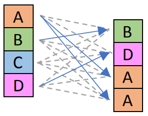
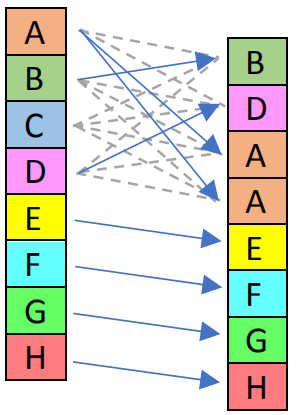
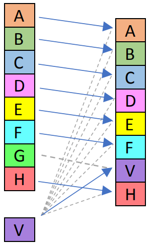
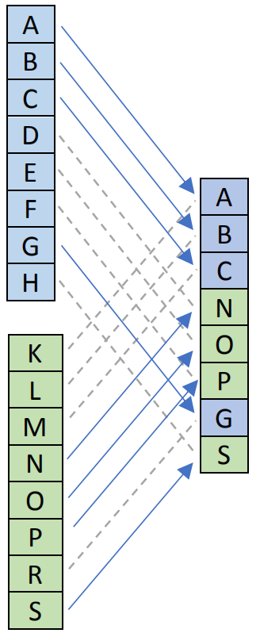
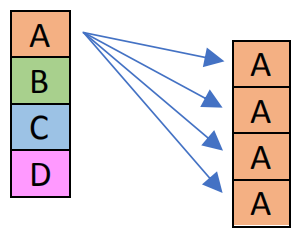

### Interger Instructions

#### Arithmetic 

##### Traditional
Additions and subtractions are totally fine and do what you would expect, e.g. `_mm_add_epi32` adds 32-bit lanes of two integer registers.

addition和subtractions如你所愿是完全没有问题的。比如`_mm_add_epi32`使两个寄存器的32bit lanes相加。

Moreover, for 8 and 16 bits, there’re saturated versions of them, which don’t overflow but instead stick to minimum or maximum values. For example, `_mm_adds_epi8( _mm_set1_epi8( 100 )`, `_mm_set1_epi8( 100 ) )` will return a vector with all 8-bit lanes set to +127, because the sum is 200 but maximum value for signed bytes is +127. Here’s more in-depth articleon saturation arithmetic.

进一步，指令集支持对于8、16bit integers的saturated的运算，即不会发生溢出而是固定在最大或最小值。比如，`_mm_adds_epi8( _mm_set1_epi8( 100 )`, `_mm_set1_epi8( 100 ) )`将返回一个全部8bit lanes为+127的向量，因为虽然和是200但是对于一个8bit有符号字节的最大值是+127，这里提供更多关于saturation计算的[文章](http://felix.abecassis.me/2011/10/sse-saturation-arithmetic/) 。

There’s no integer divide instruction. Intel has integer divide implemented in the standard library of their proprietary compiler. If you’re dividing by a compile-time constant that’s the same for all lanes, you can write a function which divides same sized scalar by that constant, compile with https://godbolt.org/ and port to SIMD. For example, here’s what it compiled when asked to divide uint16_t scalar by 11, and here’s how to translate that assembly into SIMD intrinsics:

没有integer divide指令。Intel在自己编译器的标准库中有integer divide的实现。如果对所有lanes divide一个编译期常量。你可以自己写一个函数，divide与单个lane大小的常量，使用https://godbolt.org/编译，导出到SIMD。例如，对于大小是uint16_t的lane divide 11，如下是对应的SIMD指令。

```c++
// Divide uint16_t lanes by 11, all 8 of them in just two SSE 2 instructions.
__m128i div_by_11_epu16( __m128i x ) 
{ 
    x = _mm_mulhi_epu16( x, _mm_set1_epi16( (short)47663 ) );
    return _mm_srli_epi16( x, 3 );
}
```

Multiplication is tricky as well. `_mm_mul_epi32` takes 2 values [a, b, c, d] [e, f, g, h], ignores half of the values, and returns register with 2 64-bit values [ a * e, c * g ]. The normal version is `_mm_mullo_epi32`. Oh, and both are SSE 4.1. If you only have SSE 2, you’ll need workarounds.

multiplication也是很棘手的。`_mm_mul_epi32`忽略[a, b, c, d]和[e, f, g, h]的一半数值，返回由两个64bit数值的[ a * e, c * g ]寄存器。不忽略的指令是`_mm_mullo_epi32`，两个指令都在SSE 4.1指令集中。如果你只使用SSE2指令集，需要适当变通。

##### Unorthodox
For most lane sizes there’re integer minimum and maximum instructions, e.g. `_mm_max_epu8` (SSE 2) is maximum for uint8_t lanes, `_mm_min_epi32` (SSE 4.1) is minimum for 32-bit integer lanes.

对大多数大小的integer都有对应的minimum和maximun指令。比如SSE2指令集中的`_mm_max_epu8`计算uint8_t lanes的maximum，SSE4.1指令集中的`_mm_min_epi32`计算32bit interger lanes的最小值。

SSSE 3 has absolute value instructions for signed integers. It also has horizontal addition and subtraction instructions, e.g. `_mm_hsub_epi32` takes [a, b, c, d] and [e, f, g, h] and returns [a-b, c-d, e-f, g-h]. For signed int16 lanes, saturated version of horizontal addition and subtraction is also available.

SSSE3指令集中对于signed integers有absolute value指令。也有horizontal addition和subractions指令，比如`_mm_hsub_epi32`输入[a, b, c, d]和[e, f, g, h]，返回[a-b, c-d, e-f, g-h]。对于signed int16 lanes，horizontal addition 和 subtraction 有对应的saturated版本的指令。

For uint8_t and uint16_t lanes, SSE 2 has instructions to compute average of two inputs.

对于uint8_t和uint16_t lanes，在SSE2指令集中有计算两个输入向量的average的指令。

The weirdest of them is probably `_mm_sad_epu8` (SSE2) / `_mm256_sad_epu8` (AVX2). The single instruction, which can run once per cycle on Intel Skylake, is an equivalent of the following code:

有点不可思议的是SSE2指令集中的`_mm_sad_epu8`和AVX2指令集中的`_mm256_sad_epu8`。每个指令在Intel Skylake上每次运行只需要1个cycle，与以下代码等效。

```c++
array<uint64_t, 4> avx2_sad_epu8( array<uint8_t, 32> a, array<uint8_t, 32> b ) 
{
    array<uint64_t, 4> result;
    for( int i = 0; i < 4; i++ )
    {
        uint16_t totalAbsDiff = 0;
        for( int j = 0; j < 8; j++ )
        {
            const uint8_t va = a[ i * 8 + j ];
            const uint8_t vb = b[ i * 8 + j ];
            const int absDiff = abs( (int)va - (int)vb );
            totalAbsDiff += (uint16_t)absDiff; 
        }
        result[ i ] = totalAbsDiff; 
    }
    return result; 
}
```

I think it was added for video encoders. Apparently, they treat AVX 2 register as a block of 8×4 grayscale 8-bit pixels, and want to estimate compression errors. That instruction computes sum of errors over each row of the block. I’ve used it couple times for things unrelated to video codecs, it’s the fastest ways to compute sum of bytes: use zero vector for the second argument of `_mm_sad_epu8`, then `_mm_add_epi64` to accumulate.

我想这是为视频编码设计的。很显然，设计者将AVX2寄存器视为8*4大小的8bit像素区域，然后计算compression errors。这个指令计算每行error的和。我已经多次将其用于视频编解码以外的事情。这是最快的方式计算所有字节和，将`_mm_sad_epu8`的第二个参数设为0，然后使用`_mm_add_epi64`累加。

#### Comparisons
Only all-lane versions are implemented. The results are similar to float comparisons, they set complete lane to all zeroes or all ones. For example, `_mm_cmpgt_epi8` sets 8-bit lanes of the output to either 0 or 0xFF, depending on whether the corresponding signed 8-bit values are greater or not。

comparisons只有all-lane版本的指令。结果与float comparision相似，将结果lane的所有bit设为全0或者全1。比如，`_mm_cmpgt_epi8`根据对应signed 8bit数值的比较结果，将结果对应的8-bit lane设为0或者0xFF。

Protip: a signed integer with all bits set is equal to -1. A useful pattern to count matching numbers is integer subtract after the comparison:

将所有lanes的signed integer的所有bit设为1相当于-1。在comparison后接一个subtract，可以统计符合match数量。

```c++
const __m128i cmp = _mm_cmpgt_epi32( val, threshold ); // Compare val > threshold
acc = _mm_sub_epi32( acc, cmp ); // Increment accumulator where comparison was true
```

Be ware of integer overflows though. Rarely important for counting 32-bit matches (they only overflow after 4G of vectors = 64GB of data when using SSE2), but critical for 8 and 16-bit ones. One approach to deal with that, a nested loop where the inner one consumes small batch of values which guarantees to not overflow the accumulators, and outer loop which up-casts to wider integer lanes.

注意integer的溢出。当32bit大小的integer来累加时并不重要（使用SSE2指令集时，当在4G个vector=64GB后才会发生溢出），但是使用8或者16bit的integer来说就很危险了。一种处理办法是使用nested loop，在内层循环中计算部分数值，保证accumulator不发生溢出，在外层循环中up-cast到更宽的integer lanes。

There’re no unsigned integer comparison instructions. If you need them, here’s an example how to implement manually, on top of signed integer comparison.

没有针对unsigned interger的comparison指令。如果你需要，如下例展示了如何手动实现。

```c++
// Compare uint16_t lanes for a > b
__m128i cmpgt_epu16( __m128i a, __m128i b ) 
{
    const __m128i highBit = _mm_set1_epi16( (short)0x8000 );
    a = _mm_xor_si128( a, highBit );
    b = _mm_xor_si128( b, highBit );
    return _mm_cmpgt_epi16( a, b ); 
}
```

To compare integer lanes for a <= b, a good way (two fast instructions) is this: `min( a, b ) == a`. The move mask instruction is only implemented for 8-bit lanes. If you want results of 32-bit integer comparison in a general-purpose register, 1 bit per lane, one workaround is cast `__m128i` into `__m128` and use `_mm_movemask_ps`. Similar for 64-bit lanes, cast into `__m128d` and use `_mm_movemask_pd`.

对于integer lanes 比较 a<=b，一个好的方式是`min( a, b ) == a`（由两个很快的指令组成）。move mask指令只有8bit lanes版本。如果你想将32bit integer的比较结果放在通用寄存器中，每个bit表示一个lane的结果。可以将`__m128i` cast `__m128`然后使用`_mm_movemask_ps`。同样对于64bit lanes，cast `__m128d`然后使用`_mm_movemask_pd`。

#### Shifts

##### Whole Register Shift
It can only shift by whole number of bytes.

The whole register shifts are `_mm_srli_si128` and `_mm_slli_si128` in SSE 2. AVX 2 equivalents like `_mm256_slli_si256` independently shift 16-byte lanes, so the bytes that would have been shifted across 16-byte halves of the register become zeros. If you want to shift the entire 32-byte AVX register, you gonna need a workaround, see this stackoverflow answer.

SSE2指令集中整体shift寄存器的指令有`_mm_srli_si128`和`_mm_slli_si128`。在AVX2中的相近指令是`_mm256_slli_si256`，可以分别shift两个16byte lanes，shift空出的bit被填充为0。如果你想shift整个32byte的寄存器，可以看[stackoverflow](https://stackoverflow.com/questions/66179765)的答案。

SSSE3 has `_mm_alignr_epi8` instruction. Takes 16 bytes in one register, 16 bytes in another one, concatenates them into 32-bit temporary result, shifts that one right by whole number of bytes, and keep the lowest 16 bytes.

SSSE3指令集的`_mm_alignr_epi8`指令，传入两个16字节寄存器，concatenate为一个32bit的临时变量然后整体shift，最后保留低1字节。

##### Individual Lanes Shift
SSE 2 has instructions which encode shift amount in the opcodes, and versions which take it from the lowest lane of another vector register. The shift amount is the count of bits to shift, it’s applied to all lanes. Right shift instructions come in two versions, one shifting in zero bits, another shifting in sign bits. `_mm_srli_epi16( x, 4 )` will transform 0x8015 value into 0x0801, while `_mm_srai_epi16( x, 4 )` will transform 0x8015 into 0xF801. They likely did it due to the lack of integer division: `_mm_srai_epi16( x, 4 )` is an equivalent of x/16 for signed int16_t lanes.

SSE2中的指令可以将位移量编码为opcodes，或者从另一个寄存器中将最低lane作为opcodes。shift的数量等于bits的个数，并应用在所有lanes上。右shift指令有两个版本，一个使用0（填充空余bit）另一个使用1（填充空余bit）。`_mm_srli_epi16( x, 4 )`会将0x8015修改为0x0801，`_mm_srai_epi16( x, 4 )`会将0x8015修改为0xF801。这样做的原因大概是缺少integer division指令。`_mm_srai_epi16( x, 4 )`等同于对int16_t lanes执行x/16。

##### Variable Shifts
AVX2 introduced instructions which shift each lane by different amount taken from another vector. The intrinsics are `_mm_sllv_epi32`, `_mm_srlv_epi32`, `_mm_sllv_epi64`, `_mm_srlv_epi64`, and corresponding 32-bytes versions with `_mm256_` prefix. Here’s an example which also uses the rest of the integer shifts.

AVX2指令集中，可以对每个lane shift不同的位数。这些指令是 `_mm_sllv_epi32`, `_mm_srlv_epi32`, `_mm_sllv_epi64`, `_mm_srlv_epi64`，还有对应前缀是`_mm256_`的针对32字节的版本。这是一个使用integer shift的[例子](https://stackoverflow.com/a/63759887/126995)。
#### Pack and Unpack
Unlike floats, the same data types, `__m128i` and `__m256i`, can contain arbitrary count of lanes. Different instructions view them as 8-, 16-, 32-, or 64-bit lanes, either signed or unsigned. There’re many instructions to pack and unpack these lanes.

不同于floats，`__m128i`和`__m256i`有很多种lanes。不同的指令处理8-、16-、32-或者64-bit的lanes，还包括有符号和无符号。以下是一些pack或unpack的指令。

Unpack instructions come in 2 versions. `unpacklo_something` unpacks and interleaves values from the low half of the two registers. For example, `_mm_unpacklo_epi32` takes 2 values, [a,b,c,d] and [e,f,g,h], and returns [a,e,b,f]; `_mm_unpackhi_epi32` takes 2 values, [a,b,c,d] and [e,f,g,h], and returns [c,g,d,h]. One obvious application, if you supply zero for the second argument, these instructions will convert unsigned integer lanes to wider ones, e.g. 8-bit lanes into 16-bit ones, with twice as few lanes per register.

unpack指令有两个版本，`unpacklo_something`可以unpacks并interleaves两个寄存器的低一半数值。比如`_mm_unpacklo_epi32`输入[a,b,c,d]和[e,f,g,h]输出[a,e,b,f]；`_mm_unpackhi_epi32`输入[a,b,c,d]和[e,f,g,h]输出[c,g,d,h]。一个明显的应用是，如果你将第二个参数设为0，这些指令可以将无符号integer lanes convert为更宽的lanes。8bit lanes convert到16bit lanes，自然lanes的数量也相应减半。

The opposite instructions, for packing lanes, come in 2 versions, for signed and unsigned integers. All of them use saturation when packing the values. If you don’t want the saturation, bitwise AND with a constant like `_mm_set1_epi16( 0xFF )` or `_mm_set1_epi32( 0xFFFF )`(Or you can build the magic numbers in code. It takes 3 cycles, setzero, cmpeq_epi32, unpacklo_epi8/unpacklo_epi16. In some cases, can be measurably faster than a RAM load to fetch the constant.), and unsigned saturation won’t engage.

与unpack相反的packing指令包括对有符号和无符号共两个版本。两者全部使用saturation。如果你不想使用saturation。与常量`_mm_set1_epi16( 0xFF )`或者`_mm_set1_epi32( 0xFFFF )`bitwise AND（或者使用setzero, cmpeq_epi32, unpacklo_epi8/unpacklo_epi16，花费3个cycles，有些情况，比同RAM中load常量更快），但是对无符号的saturation无效。

`_mm_packs_epi16` takes 2 registers, assumes they contain 16-bit signed integer lanes, packs each lane into 8-bit signed integer using saturation (values that are greater than +127 are clipped to +127, values that are less than -128 are clipped to -128), and returns a value with all 16 values.`_mm_packus_epi16` does the same but it assumes the input data contains 16-bit unsigned integer lanes, that one packs each lane into 8-bit unsigned integer using saturation (values that are greater than 255 are clipped to 255), and returns a value with all 16 values.

`_mm_packs_epi16`将两个16bit有符号integer lanes的寄存器，pack每一个lanes为8bit有符号的integer，并且使用saturation（也就是说大于+127的值截取为+127，小于-128的截取为-128），然后返回共16个值的向量。`_mm_packus_epi16`将两个16bit无符号integer lanes的寄存器，pack每一个lane为8bit无符号integer，并且使用saturation（也就是说大于255的将截取为255），然后返回共16个值的向量。

Before AVX2, unpacking with zeroes was the best way to convert unsigned integers to wider size. AVX2 introduced proper instructions for that, e.g. `_mm256_cvtepu8_epi32` takes 8 lowest bytes of the source, and converts these bytes into a vector with 8 32-bit numbers. These instructions can even load source data directly from memory.

在AVX2指令集之前，与0做unpack是最好的方式来convert无符号integer到更大的宽度。AVX2指令集中引入了更合适的指令，比如`_mm256_cvtepu8_epi32`将原数据的8个最低的字节convert为8个32bit的数值，这些指令甚至可以直接从内存load数据。


#### Shuffles
Besides pack and unpack, there’re instructions to shuffle integer lanes

|                                                                                               |         |                                                                                                                                                                                                                                                                                                                                                          |                                                                                                                                                                                                 |                                                       |
| --------------------------------------------------------------------------------------------- | ------- | -------------------------------------------------------------------------------------------------------------------------------------------------------------------------------------------------------------------------------------------------------------------------------------------------------------------------------------------------------- | ----------------------------------------------------------------------------------------------------------------------------------------------------------------------------------------------- | ----------------------------------------------------- |
| `_mm_shuffle_epi32`                                                                           | SSE 2   | Shuffle 32-bit integer lanes.The picture on the right is for the shuffle constant 0b00001101 which is 0x0D in hexadecimal.                                                                                                                                                                                                                               | shuffle 32bit integer lanes，右侧的图像对应shuffle常量为0b00001101，或者十六进制的0x0D。                                                                                                        |     |
| `_mm_shufflelo_epi16`                                                                         | SSE 2   | Shuffles lower 4 of the 16-bit integer lanes. The upper 64 bit is copied from source do destination. The picture on the right is for shuffle constant 0x0D.                                                                                                                                                                                              | shuffle低4个16bit integer lanes，高64bit将原数据复制到目标，右侧图像对应shuffle常量为0x0D。                                                                                                     |   |
| `_mm_shufflehi_epi16`                                                                         | SSE 2   | Similar to the above, copies the lower 4 lanes, and shuffles the higher 4 lanes into the higher lanes of the result.                                                                                                                                                                                                                                     | 与上述指令相似，复制低4个lanes，然后shuffle高4个lanes。                                                                                                                                         |                                                       |
| `_mm_insert_epi16`                                                                            | SSE 2   | Insert a 16-bit integer value. Unlike the floating-point inserts, the integer to insert V comes from a general-purpose register. If you have it in another vector register, you may want to do something else, like a shift followed by blend. The index where to insert is encoded into the instruction. On the picture to the right, that index was 6. | insert一个16bit integer，与float的insert不同， insert的数据V来自通用寄存器。如果你想insert另一个向量寄存器，你可以使用其他指令，比如shift加blend。insert指令需要输入索引。右侧图像标识索引为6。 |      |
| `_mm_insert_epi8`, `_mm_insert_epi32`, `_mm_insert_epi64`                                     | SSE 4.1 | Similar to the above but inserts 8-, 32- or 64-bit lanes.                                                                                                                                                                                                                                                                                                | 与上述指令相似，不过插入的integer换成8bit、32bit、64bit。                                                                                                                                       |                                                       |
| `_mm_shuffle_epi8 `                                                                           | SSSE 3  | Shuffle 8-bit lanes, taking shuffle indices from another vector register. See the separate section of this article for more information.                                                                                                                                                                                                                 | shuffle 8bit lanes，shuffle索引来自另一个向量寄存器。                                                                                                                                           |                                                       |
| `_mm_blend_epi16`                                                                             | SSE 4.1 | Blend 16-bit lanes. The blend bit mask is encoded into the instruction. On the illustration to the right, that constant was 0b10111000 = 0xB8                                                                                                                                                                                                            | blend 16bit lanes，blend mask为另一个常量，右侧图像对应的常量是0b10111000 = 0xB8                                                                                                                |       |
| `_mm_blend_epi32`                                                                             | AVX 2   | Similar to the above, but blends 32-bit lanes instead of 16-bit ones, and marginally faster.                                                                                                                                                                                                                                                             | 与上述指令相似，不过blend对象换成了32bit lanes，并且性能更快                                                                                                                                    |                                                       |
| `_mm_blendv_epi8`                                                                             | SSE 4.1 | Blends 8-bit lanes, but unlike the rest of them, blending bit mask is not encoded in the instruction, it comes from another, third input register. The instruction uses highest bit of each 8-bit lane to select each lane of the result from either of the two first input registers.                                                                   | blend 8bit lanes，但是与其他blend不同，blend mask不是常量而是另一个向量寄存器，指令通过使用该向量寄存器的每个8bit lane的最高bit来决定从哪个输入的寄存器中选择。                                 |                                                       |
| `_mm256_permutevar8x32_epi32`                                                                 | AVX 2   | A rare instruction which can permute values across 128-bit lanes, and the permite constants are not encoded in the instruction.                                                                                                                                                                                                                          | 一个不常见的指令可以permute整个256bit，permute常量是另一个向量                                                                                                                                  |                                                       |
| `_mm_broadcastb_epi8`, `_mm_broadcastw_epi16`, `_mm_broadcastd_epi32`, `_mm_broadcastq_epi64` | AVX 2   | Broadcast the lowest lane to the rest of them. The picture to the right is for `_mm_broadcastd_epi32` instruction.                                                                                                                                                                                                                                       | broadcast最低lane到其他lanes，右侧图像表表示`_mm_broadcastd_epi32`的结果。                                                                                                                      |  |

##### _mm_shuffle_epi8
This instruction is a part of SSSE 3 set, and it deserves a dedicated section in this article. It’s the only SSE instruction that implements runtime-variable shuffles. Unlike the rest of the shuffles, this one takes shuffle values from a vector register. Here’s a C++ equivalent of that instruction:

这条指令在SSSE3指令集中，并值得用一个单独的章节来介绍。这是在SSE指令集中唯一的运行时shuffles，与其他的shuffles不同，它从另一个向量寄存器中读取shuffle的值，下面是这个指令等价的C++代码。

```c++
array<uint8_t, 16> shuffle_epi8( array<uint8_t, 16> a, array<uint8_t, 16> b ) 
{
    array<uint8_t, 16> result;
    for( int i = 0; i < 16; i++ )
    {
        const uint8_t mask = b[ i ];
        if( 0 != ( mask & 0x80 ) )
            result[ i ] = 0;
        else
            result[ i ] = a[ mask & 0xF ]; 
    }
    return result; 
}
```

Only unlike the above C++ code with the loop, `_mm_shuffle_epi8` has 1 cycle latency, and the throughput is even better, the computer I’m using to write this article can run 2 or them per clock. Can be quite useful in practice. Here’s one example which uses the first argument as a lookup table, and the second one as indices to lookup, to compute Hamming weight of integers. In some cases, that version can be faster than dedicated POPCNT instruction implemented in modern CPUs for counting these bits. Here’s another, this one uses it for the intended purpose, to move bytes around. 

与上述C++代码中使用的循环不同，`_mm_shuffle_epi8`的latency只需要1cycle，throughput甚至更好，笔者当前的电脑一个clock可以运行两次。因此在实践中很有用。这个[例子](https://stackoverflow.com/questions/17354971)中，第一个参数作为查找表，第二个作为要使用查找表的索引，来计算integer的Hamming weight。在现代计算机中，当想要计数时，有些时候这个版本比使用专用的POPCNT指令的实现还要快。另一个[例子](https://stackoverflow.com/questions/66091979)，在这个例子中使用这个指令根据预设来move字节。

The AVX2 equivalent, `_mm256_shuffle_epi8`, shuffles within 128-bit lanes, applying the same algorithm onto both 128-bit pieces, using the corresponding piece of the second argument for shuffle control values.

同样在AVX2指令集中对应`_mm256_shuffle_epi8`，将整个256bit的分为两半，分别使用相同的shuffle规则，使用第二个参数来控制shuffle。