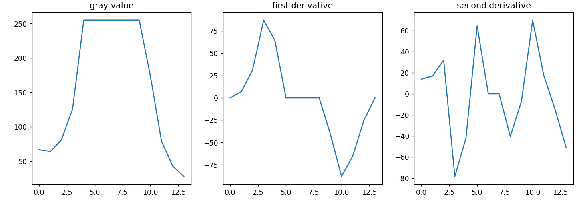

# 一维测量的一种实现

本文主要介绍一种亚像素级一维边缘检测方法。主要参考《机器视觉算法与应用（第二版）》3.7节。

## 一维边缘定义
这里建议提前阅读《数字图像处理（第四版）》3.6.1节和10.2节。我们一般认为在图像中从背景至目标像素灰度发生突变的位置作为边缘。

针对一维边缘（图像灰度剖面），即一个灰度数值序列，我们视为一元离散函数，则认为其一阶导数的绝对值局部最大值也是二阶导数的过零点为边缘，同时我们可以通过一阶导数的符号确定其是边缘的过渡是从亮至暗还是从暗至亮。

一阶导数计算如下：

$$
\frac{\partial f(x)}{\partial x}=f^{'}(x)=\frac{f(x+1)-f(x-1)}{2}
$$

二阶导数计算如下：

$$
\frac{\partial^{2} f(x)}{\partial x^{2}}=f^{''}(x)=f(x+1)+f(x-1)-2f(x)
$$

### 边缘提取



上图是提取的一个真实边缘和其对应的一阶、二阶导数曲线。因为噪声、直观度等因素的影响，使用一阶导数定位边缘更佳。设置当一阶导数值$|f^{'}(x)|>t$时，该点为边缘。为了获得唯一的边缘，即$\partial f(x)|$时局部最大的，需要加入非最大抑制（可参考canny算子中非极大值抑制步骤，一维的情况且更为简单），即要求边缘点与（沿着梯度方向上）两侧的两个像素相比其一阶导数值是最大的。

### 噪声抑制

1. 垂直平滑操作，统计垂直于剖面方向两侧的像素，计算灰度平均值。
2. 边缘滤波，使用高斯滤波器平滑。

### 亚像素定位
基于上述操作获得的边缘是像素级的。一种简单的亚像素级边缘计算方法为：将提取的边缘像素及两侧共三个点，使用一阶导数值拟合抛物线（一元二次曲线），将抛物线的最大值$-\frac{b}{2a}$视为亚像素边缘点。

## 代码实现
```python
import cv2
import numpy as np


def measure_pts(values, thresh_val, sigma):
    # 获取一阶导数
    _1d_kernel = np.array(((-0.5, 0, 0.5), ), dtype=np.float32)
    values = cv2.filter2D(values, cv2.CV_32F, _1d_kernel)
    # 高斯平滑，影响测量结果
    gau_kernel = cv2.getGaussianKernel(3, sigma, cv2.CV_32F).reshape(1, -1)
    values = cv2.filter2D(values, cv2.CV_32F, gau_kernel)
    coords = []
    # 使用非最大值抑制
    for i in range(1, values.size):
        if (values[0][i] > thresh_val and values[0][i] > values[0][i - 1]
                and values[0][i] > values[0][i + 1]) or (
                    values[0][i] < -thresh_val
                    and values[0][i] < values[0][i - 1]
                    and values[0][i] < values[0][i + 1]):
            coords.append(i)

    edge_pts = []
    for _x in coords:
        # 拟合抛物线
        a, b, _ = np.polyfit(np.arange(_x - 1, _x + 2),
                             values[0, _x - 1:_x + 2], 2)
        # 抛物线极值点即为亚像素边缘
        edge_pts.append(-b / 2 / a)
    return edge_pts


# 获取的剖面灰度值，为了使用cv2.filter2D，a.shape==(1,-1)。
a = np.array(
    ((67, 64, 81, 126, 255, 255, 255, 255, 255, 255, 174, 79, 43, 28), ),
    dtype=np.uint8)
measure_pts(a, 30, -1)
```

## 与成熟商业库的比较

经测试，上述方法与Halcon中`measure_pos`算子的计算结果在给定剖面灰度值的情况下差别在±0.01像素。在Halcon手册中也提到了两种噪声抑制方法，使用一阶梯度确定边缘的方式。但我们可以在《机器视觉算法与应用（第二版）》中读到更多处理细节，比如非最大值抑制、抛物线拟合，所以此书虽然较为精简，却十分建议阅读。

同时本文并未在代码中并未涉及垂直方向平滑，以及真实灰度剖面的获取，因为如果要计算的剖面是斜线、圆弧时需要采用插值方法进行采样，更不要提商业软件中方便的可视化灰度、导数曲线。经测试在使用双线性插值方法获取1像素宽度的直线剖面时，上述方法与Halcon对长度测量结果差别在±0.05像素（受高斯平滑参数影响较大，且Halcon中定位的边缘点不在选择的斜线上）。