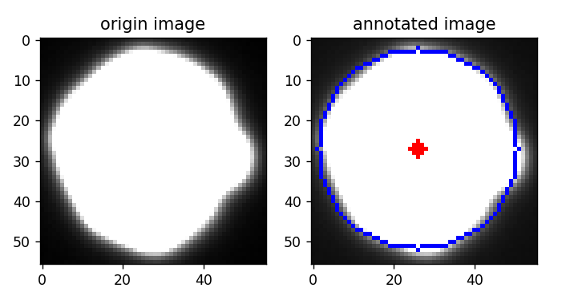

# 一种使用灰度值矩拟合亚像素精度圆的方法

## 图像矩
对于图像$I$，位置$(x,y)$处的图像灰度值表示为$I(x,y)$，则图像的$(i,j)$阶矩$m_{(i,j)}$表示为：

$$
m_{(i,j)}=\sum_{x}\sum_{y}x^{i}y^{j}I(x,y)\tag{1}
$$

比如对于$m_{0,0}=\sum_{x}\sum_{y}I(x,y)$，表示图像灰度总和。

图像质心$(\overline{x},\overline{y})$可以表示为：

$$
\overline{x}=\frac{m_{1,0}}{m_{0,0}}，
\overline{y}=\frac{m_{0,1}}{m_{0,0}}\tag{2}
$$
## 使用灰度值矩拟合圆
在《机器视觉算法与应用》（第二版）第3.5.2.4节中，介绍了一种使用灰度值距求得亚像素级精度圆的位置和面积，书中介绍该方法在处理小物体时，灰度值距能得到精确度更好的处理结果。

在Halcon中该方法归纳为area_center_gray算子。该函数签名为
```
area_center_gray(Regions, Image : : : Area, Row, Column)
```
输入参数为待计算区域Regions和图像Image，输出参数为面积Area，圆心坐标Row、Column。

在官方文档中，介绍了计算方法：对于面积Area则表示为Region区域内图像Image的灰度值和$m_{0,0}$。对于圆心，则与公式（2）一致。圆半径计算公式为：

$$
r=\sqrt[2]{\frac{Area}{foreground\times \pi}}
$$

foreground表示前景灰度值，即圆内灰度值。

## 注意事项
- Region区域的设定可通过阈值分割等手段获得，因此Region的质量会影响圆心的判断，尤其是边缘的分割质量。
- 计算圆半径的公式，要求圆内灰度值一致。
- 此方法适合小物体（像素数较少）的测量，对于大物体（像素数较多）效果可以想象并不优越。

## OpenCV代码实现
```python
import cv2
import numpy as np
import math


def area_center_gray(contour, image):
    mots = cv2.moments(contour)
    x = mots["m10"] / mots["m00"]
    y = mots["m01"] / mots["m00"]
    center = (x, y)
    # 使用mask，仅统计contour内像素
    mask = np.zeros_like(image)
    cv2.drawContours(mask, [contour], -1, 255, -1)
    image = cv2.bitwise_and(image, mask)
    area = cv2.sumElems(image)[0]

    return center, area


org_img = cv2.imread("images\\gray_hole.bmp", 0)
_, th_img = cv2.threshold(org_img, 50, 255, cv2.THRESH_BINARY)

foreground_val = 255

contours, _ = cv2.findContours(th_img, cv2.RETR_EXTERNAL,
                               cv2.CHAIN_APPROX_SIMPLE)
for cnt in contours:
    center, area = area_center_gray(cnt, org_img)
    radius = math.sqrt(area / foreground_val / math.pi)
```

函数`area_center_gray`基本模拟Halcon中表现，由于OpenCV中没有Region对象，因此使用`contour`替换，函数返回圆心`center`和灰度值面积`area`。

在测试代码中，使用简单阈值分割和`findcontours`函数，对圆区域进行定位。通过公式（2）计算圆半径`radius`。拟合结果如下所示：

