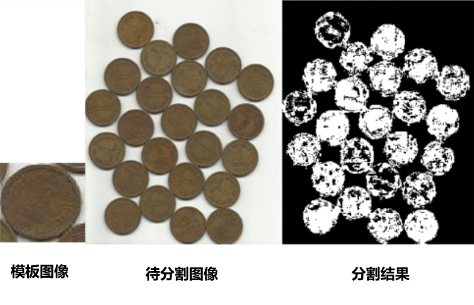

# 图像直方图杂记

本文主要总结对图像直方图的使用和理解。主要包括函数使用技巧，我对直方图均衡化理解，反向投影算法等。

图像直方图是分析图像的一种重要工具，它反映了一张图像灰度值的分布情况，或者解释为图像中出现某一灰度值出现的概率估计（归一化后）。更多内容建议阅读《数字图像处理》（第四版）第3.3节“直方图处理”。

## OpenCV与Numpy中的实现
OpenCV中函数实现为[`cv::calcHist`](https://docs.opencv.org/4.5.3/d6/dc7/group__imgproc__hist.html#gada9d547662b7f832dd7b93d378b1137d)
Numpy中函数实现为[`np.histogram`](https://numpy.org/doc/stable/reference/generated/numpy.histogram.html)
具体函数使用建议直接阅读对应文档链接。

简单的实例代码如下：

```
org_img = np.random.randint(0, 255, (2000, 2000), dtype=np.uint8)
hist = cv2.calcHist([org_img], [0], None, [256], [0, 256])
hist1 = np.histogram(org_img, 256)
```

使用line_profiler对比两个函数性能，可以发现Numpy（90-100ms@2000×2000分辨率）的耗时是OpenCV（2-3ms@2000×2000分辨率）的**30-50倍**，而且OpenCV中可以方便地添加掩膜（mask）。再次印证：对于绝大多数图像操作OpenCV的效率高于Numpy。

## 直方图均衡化的一种理解

直方图均衡化严格数学推导建议阅读《数字图像处理》（第四版）第3.3.1节“直方图均衡化”，这里针对书中公式3.15，即针对实际数字图像中使用的公式，给出一个更加通俗的解释。

### 计算公式

$$
s_{k}=T(r_{k})=(L-1)\sum_{j=0}^{k}p_{r}(r_{j}),k=0,1,2,...,L-1\tag{1}
$$

式中$L$表示灰阶数；$p_{r}(r_{j})=\frac{n_{j}}{MN}$表示对于图像中灰度值为j的像素数量$n_{j}$除以图像像素总数$MN$，即表示图像中灰度值为j的像素的概率密度；则原图中灰度值为$r_{k}$的像素在经过均衡化后的赋给的新灰度值$s_{k}$如上述公式（1）表示。

<small>

注意区分$r_{k}$和$r_{j}$。

</small>

### 公式理解

如何更形象的理解该公式呢？我们将$L-1$移至等式左边，并去掉$-1$（在实际使用过程中需要添加$-1$以保证灰度值最大值为$L-1$），展开$p_{r}(r_{j})$，公式（1）改写为：

$$
\frac{s_{k}}{L}=\frac{\sum_{j=0}^{k}n_{j}}{MN},k=0,1,2,...,L-1\tag{2}
$$

对于理想的均衡化的图像，各灰度的像素数量应该是相等的，换另一种表述则该图像**对于所有灰度值$k$，公式（2）等号左边（灰度值$s_{k}$与$L$的比值），与公式（2）等号右边（在$[0-s_{k}]$间的像素总数与图像总像素数${MN}$的比值）应该是相等的**。则该公式可以作为一张图像是否满足直方图均衡化的判据。

对于未均衡化的图像

$$
\frac{r_{k}}{L}\overset{?}{=}\frac{\sum_{j=0}^{k}n_{j}}{MN},k=0,1,2,...,L-1\tag{3}
$$

则等式显然不是恒成立的。那么根据$r_{k}$求出的公式右边$\sum_{j=0}^{k}n_{j}$，再将所有$r_{k}$映射（替换）为对应的$s_{k}$，形成的新图像即可满足均衡化条件。

举例来说，统计灰度值为0的像素的总数量占总像素数为1%，对于均衡化的直方图1%对应的灰度值是$[0.01\times255]=3$（这里我们使用$L-1$作为灰度最大值），则将灰度值为0的像素替换灰度值3，这样就能满足均衡化条件。对于灰度值为1的像素，统计0至1像素的总数量占总像素数为2%，则将灰度值为2的像素替换灰度值$[0.02\times255]=5$，计次计算所有灰度值即可。

## 反向投影（Back Projection）

反向投影是一种使用直方图进行图像分割的一种方法，OpenCV中提供的函数为
[`cv::calcBackProject`](https://docs.opencv.org/4.5.3/d6/dc7/group__imgproc__hist.html#ga3a0af640716b456c3d14af8aee12e3ca)
，另OpenCV文档中提供了[指南](https://docs.opencv.org/4.5.3/da/d7f/tutorial_back_projection.html)建议阅读。

### 算法流程

1. 制作一张模板图像，在这张图像中包含要提取的目标。
2. 选择合适的窗口大小（histSize），计算该模板图像的直方图，并将其值归一化至图像灰阶范围内（便于后续赋值）。
3. 遍历待分割图像的像素，按照其在模板直方图的所对应窗口（bin）读取其直方图值（即归一化的像素数），遍历完毕，将所有取值生成一张新图像。
4. 对新图像使用阈值分割，即是待分割图像的分割结果。

举例：当我们计算模板图像的直方图如下时（已归一化至`CV_8U`范围，实际选择的histSize一般远大于5个，且各窗口大小是相等的）：

  | 窗口     | [0,50) | [50,100) | [100,150) | [150,200) | [200,255] |
  | -------- | ------ | -------- | --------- | --------- | --------- |
  | 直方图值 | 0      | 10       | 255       | 100       | 5         |

首先创建与待分割图像相同大小的投影图像。然后遍历待分割图像中像素，如其灰度值为70，查找70在模板直方图$[50,100)$窗口内，将直方图值10赋值到投影图像相同坐标。如其灰度值为120，查找120在模板直方图$[100,150)$窗口内，则将255赋值到投影图像对应坐标。

### 原理思路

从上述例子中可以看到，投影图像中的像素灰度值与待分割图像对应像素灰度值在模板直方图中对应窗口值相关，即与模板图像中出现概率相关。当投影图像中灰度值更大时，代表待分割图像中对应像素的灰度值在模板图像的直方图数值更大，则大概率出现在模板图像中时，即是我们认为的分割目标。因此我们可以将其视为一种“无参”阈值分割或直方图“匹配”，阈值通过模板图像直方图自动生成。

OpenCV在文档中总结的更为形象，直接搬运如下：

- “Back Projection is a way of recording how well the pixels of a given image fit the distribution of pixels in a histogram model”.
- “To make it simpler: For Back Projection, you calculate the histogram model of a feature and then use it to find this feature in an image”.

### 注意事项

在使用中有以下注意：

- 在模板图像中尽可能地只包含要提取的目标，或者使用在计算直方图时使用掩膜，以减少干扰像素的影响；
- 选择恰当的histSize至关重要；
- 由于该方法使用直方图（灰度值）进行分割，不同于灰度图，针对彩色图像使用HSV空间的H、S通道生成的2d直方图的分割效果更佳。

### 算法改进

在算法流程第三步中，我们可以看到模板直方图的制作是分割效果好坏的关键。在OpenCV文档的另一篇[文章](https://docs.opencv.org/4.5.3/dc/df6/tutorial_py_histogram_backprojection.html)提到，在原始论文[点击可下载](http://twiki.cis.rit.edu/twiki/pub/MVRL/HistogramAnalysisTechniques/AAA-Indexing_Via_Color_Histograms_Swain_Ballard_1991.pdf)中，模板直方图在使用之前依次做如下处理：

1. 对模板直方图所有值，除以待分割图像对应的直方图值；
2. 对模板直方图所有值，取1与该值的最小值；
3. 将模板直方图与“理想低通滤波器”做卷积；
4. 将原第二步骤的归一化移至该步骤实现。

我们可以大致猜测其用意。第一步可以抑制部分模板直方图中的噪声（仅限待分割图像中有大量该灰度值的噪声时，通过除法降低直方图值）；第二步可以保证在待分割图象中有一个模板图像中的目标，抑制过大值；第三个可以平滑直方图（扩大目标在直方图的灰度范围），使分割效果更佳均匀。

### 代码示例

```python
# 读取模板图像
roi = cv2.imread('tmplcoin.png')
hsv = cv2.cvtColor(roi, cv2.COLOR_BGR2HSV)
# 读取待分割图像
target = cv2.imread('coins.jpg')
hsvt = cv2.cvtColor(target, cv2.COLOR_BGR2HSV)
# 计算模板图像h-s通道的2d直方图
roihist = cv2.calcHist([hsv], [0, 1], None, [20, 35], [0, 180, 0, 256])
# 将直方图归一化至255
cv2.normalize(roihist, roihist, 0, 255, cv2.NORM_MINMAX)
# 计算反向投影
dst = cv2.calcBackProject([hsvt], [0, 1], roihist, [0, 180, 0, 256], 1)
# 对投影图像进行阈值分割
_, thresh = cv2.threshold(dst, 50, 255, 0) 
```

分割结果见下图所示：



可以看到实际上该方法的分割结果较为一般，该方法的主要是在视频跟踪领域的MeanShift等算法中使用。