# 由浅入深理解C/C++指针-《4小时彻底掌握C指针》笔记

本文主要是笔者整理《4小时彻底掌握C指针》系列视频的笔记，该视频是印度人Harsha Suryanarayana（可惜老哥英年早逝）图文并茂讲解的指针教程，已被好心人翻译为[中文视频](https://www.bilibili.com/video/BV1bo4y1Z7xf?p=1)。不同于一般的笔记，笔者希望本文能够独立成文，以便读者未看过视频也可以顺畅阅读。同时在文中已经添加本人的注解“*笔者注*”，作为本人理解方便大家阅读。

笔者C++功底有限，如有错误，欢迎指正。


## 第一节：指针基本介绍
### 变量在内存的存储
如图中右侧图形表示计算机内存（memory），图形中每一个长条表示一个字节（byte），每一个字节存在对应的一个地址，如左侧0、201、202...209所标注。

<Zoom>  </Zoom>

对于典型的现代计算机，1个`int`类型变量由4个字节表示，1个`char`类型变量由1个字节表示，1个float类型变量由4个字节表示。对于如下代码：

```c
int a;
char c;
a = 5;
a++;
```

在内存中，如内存模型所示：计算机分配地址为204-207共4个字节的存储变量`a`，分配地址为209的1个字节存储变量`c`，当给`a`赋值5时，将在地址204-207的内存处存储5（真实中数字以二进制保存），`a`自加1则会对地址204-207内存位置存储的5加1。

*笔者注*：在C/C++语言中，内存模型极为重要，通过指针直接操作“真实”的内存，具有极大的灵活性。

### 指针变量在内存的存储
指针变量作为一种变量也是存储在内存中，其中存储的数据类型是内存地址。对于如下代码：

```c
int a;
int* p;
p = &a;
a = 5;
printf("%d\n", p); // 204
printf("%d\n", &a); //204
printf("%d\n", &p); //64
printf("%d\n", *p); // 5
*p = 8;
printf("%d\n", a); //8
```

结合下图右侧内存模型。首先计算机分配内存地址204-207存储`a`，第二行定义变量`p`，变量`p`是一个 `int*`类型的变量，其内存地址为64-67（对于32位系统，使用4个字节表示一个内存地址），该变量存储了一个`int`类型变量的地址，随后`&a`表示获取了变量`a`的地址并赋值给变量`p`，即变量`p`中存储的值为变量`a`的地址204。

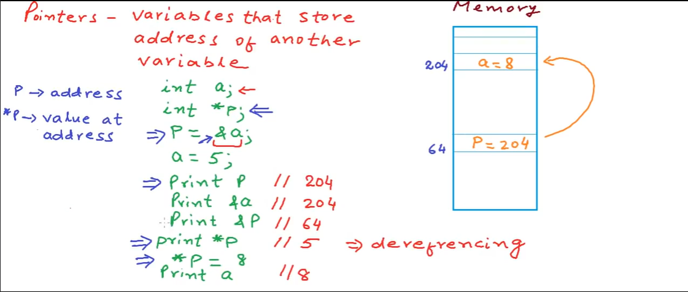

因此，当我们打印`p`的值时输出为204，当打印`a`的地址`&a`时输出为204，当打印p的地址`&p`时输出为64，当打印变量`p`的解引用`*p`时（解引用表示，取出变量`p`内存储的地址204所存储的变量`a`）输出为5，当对`*p`赋值为8后，即修改了变量`a`的值，此时打印`a`输出为8。

*笔者注*：在该节中，我避免使用指向这个动词，强调指针首先是一个变量（名词），指向是因为变量存储的是地址而赋予它的能力，但实际上使用指向描述是更为形象的，从语言上指向这个变量和存储这个变量的内存地址是等价的。
## 第二节：指针代码示例
在该节中，视频主要复习了指针的基本使用，需要强调的是如下关于指针的运算。如下代码：

```c
int a = 10;
int* p = &a;
// Pointer arithmetic
printf("%d\n", p);    // 204
print("%d\n", p+1);   // 208
```

指针`p`指向`int`类型变量`a`。当打印变量`p`时即变量`a`的地址输出为204，当打印`p+1`时，其输出应为208，应理解为指向变量`a`后面下一个`int`类型变量的地址（p+1处地址并未赋值，因此使用`*(p+1)`是危险的）。

*笔者注*:这里能够初见看出为什么声明指针变量是有不同类型的，下一节将详细讨论。

## 第三节：指针的类型、算数运算、void指针
### 不同类型指针运算
在本节开始视频作者介绍，虽然指针变量内存储的地址都是同一类型的，但是不同类型的指针表示其指向不同类型的变量，尤其是在使用解引用`*`时。

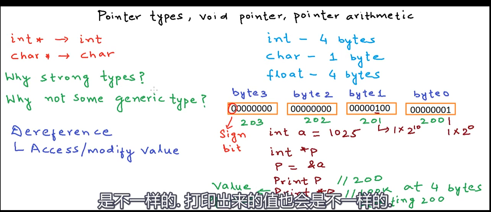

如上图所示，对于一个整型变量`a`（见图片右侧中间部分），当赋值1025时，其对应的四个字节200-203存储的二进制数字分别为00000000 00000000 00000100 00000001，如图中标注（小端，字幕标注为LSB）。考虑如下代码：

```c
int a = 1025;
int* p = &a;
char* p0;
p0 = (char*)p; // typecasting
printf("%d, %d\n", p, *p); // 200, 1025
printf("%d, %d\n", p+1, *(p+1)); // 204, -2454153 
printf("%d, %d\n", p0, *p0); // 200, 1
printf("%d, %d\n", p0+1, *(p0+1)); // 201, 4
// 1025= 00000000 00000000 00000100 00000001
```

代码第4行，`(char*)`是一种强制类型转换，表示把`int*`类型变量`p`强制转换为`char*`。

当打印`p`时输出为变量`a`的地址200，当打印`*p`时输出为变量`a`的值1025，当打印`p+1`时输出为变量`a`下一个`int`类型变量地址204，当打印`*(p+1)`时输出为未初始化的随机`int`类型值比如为-2454153。当打印`p0`时输出变量`a`的首个字节的地址200，当打印`*p0`时输出地址200存储的数值0b00000001（0b表示二进制）即为1，当打印`p0+1`时输出地址200后一个`char`类型变量的地址201，当打印`*(p0+1)`时输出地址201存储的数值0b00000100即为4。

*笔者注*：可以看到不同类型的指针在解引用时，所读取的字节数与指针所指向的数据类型相关。比如：如果为`int*`则读取该地址及后面共4个字节存储的数据，指针变量+1则地址数值+4；如果为`char*`则读取该地址1个字节存储的数据，指针变量+1则地址数值+1，可以通过`sizeof`关键字确定类型大小。

### 通用类型指针`void*`

```c
int a = 1025;
void* p1;
p1 = &a;
printf("%d\n", p1); //200
// printf("%d\n",*p1);
// printf("%d\n",p1+1);
```

如上代码所示，无需类型转换，可以将任意类型变量的地址赋值给`void*`类型指针，但是该类型指针只能打印地址，无法使用解引用`*`以及`+1`等运算操作。

## 第四节：指向指针的指针
指针可以指向各种类型变量，即指针可以存储各种类型变量的地址，当然指针可以指向一个指针。

```c
int x = 5;
int* p = &x;
*p = 6;
int** q = &p;
int*** r = &q;
printf("%d\n", *p); //6
printf("%d\n", *q); //225
printf("%d\n", *(*q)); //6
printf("%d\n", *(*r)); //225
printf("%d\n", *(*(*r))); //6
```

如上代码，可以定义指针的指针`int**`类型的变量`q`，以及指针的指针的指针`int***`类型的变量`r`，在使用时，只要逐层解引用即可。
其内存模型如下，我们可以更方便的查看变量里面所存储的数值。

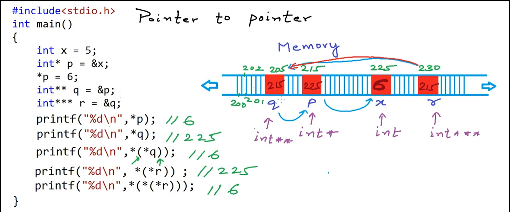

*笔者注*：本节`printf`的输出，不再解释。通过此节相信读者可以更强烈的感受到指针操作内存的便捷。

## 第五节：函数传值vs传引用
### 按值传递
```c
#include<stdio.h>
void Increment(int a){
    a = a+1;
    printf("%d\n", &a);
}
int main(){
    int a;
    a = 10;
    Increment(a);
    printf("a=%d\n", a);
    printf("%d\n", &a);
}
```

首先以上面代码为例解释函数按值传递。在`main`函数中，我们定义了变量`a`，并试图调用`Increment`函数使`a`增加1。但是当我们测试该代码时发现，`a`的值并没有如愿+1=11。我们同时打印了`a`在`main`函数和`Increment`函数中的地址，我们发现两者地址是不一样的，即两个函数中的`a`并不是同一个`a`，因此在`main`函数中的`a`并没有+1。

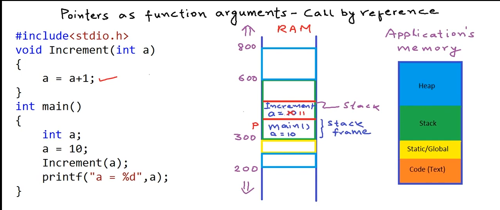

视频作者接下来解释了为什么。如上图中，最右侧是一个典型应用程序所使用的内存的分布，包括了代码区、全局区、栈区、堆区（这里不详细介绍每个区的用处）。如中间内存模型所示，函数中的变量（称为局部变量）是放在栈区的，如图中内存地址300-600的绿色框。首先调用`main`函数，系统将在栈区开辟一块内存（称为栈帧stack frame）存放`main`函数中的变量，如`a = 10`；接着在`main`中调用了函数`Increment`，系统将在“上面”继续开辟一块内存存放`Increment`函数中的变量，接着复制一份`main`函数中的`a`到`Increment`函数中的`a`，因此我们将`Increment`函数中的`a`+1，并不影响在`main`函数中的`a`，因为两个`a`是分属于两个不同函数的两个不同的局部变量。因此这种将一个函数中的变量（称为实参）通过复制的方式传递给被调函数的参数（称为形参），改变形参并不影响实参，这种传递方式称为**按值传递**。

*笔者注*：关于栈帧的概念强烈建议阅读相关资料，里面虽涉及到汇编、寄存器等概念，但并不难。

### 按指针传递
那么如何在`Increment`函数中修改`main`函数中的`a`呢？就是使用指针传递，如下代码：

```c
#include<stdio.h>
void Increment(int* p){
    *p = *p+1;
}
int main(){
    int a;
    a = 10;
    Increment(&a);
    printf("a=%d\n", a);
}
```

在该代码中将`main`函数中的`a`的地址传递给`Increment`函数中的变量`p`，通过解引用直接修改对应地址处（即`mian`函数中的`a`）的数值，达到目的。如下图中间部分内存模型所示：

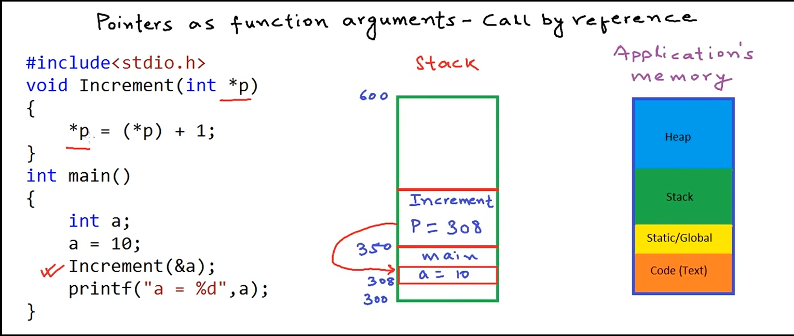

将`a`的内存地址308传给`Increment`函数中的变量`p`，即变量`p`指向了`main`函数中的变量`a`，使用解引用即可达到修改`main`函数中的`a`的目的。这种通过将变量的指针传递给被调函数达到修改变量的传递方式称为按**指针传递**（视频中称为按引用传递，在C++中应该将其区分）。

最后，视频作者提到，当变量占用内存比较大时，相比于按值传递，指针传递是一种更为高效的方式。

*笔者注*：在C++中添加了“引用”这一概念，因此还有一种按引用传递，可以查阅资料了解引用与指针的区别。

## 第六节：指针和数组
对于如下代码：

```c
int A[5] = {2, 4, 5, 8, 1};
int* p = &A[0];   // int* p = A
printf("%d\n", p); //200
printf("%d\n", *p); //2
printf("%d\n", p + 2); //208
printf("%d\n", *(p + 2)); // 5
```

参照如下图中的内存模型，在内存中数组`A[5]`中的五个`int`类型数值被连续放置在200-219地址中。当定义指针变量`p`并指向`A[0]`即数组的第一个元素的地址时，打印`p`则输出`A[0]`的地址200，打印`*p`则输出`A[0]`存储的数值2，打印`p+2`则输出`A[2]`的地址208，打印`*(p+2)`则输出`A[2]`存储的数值5。

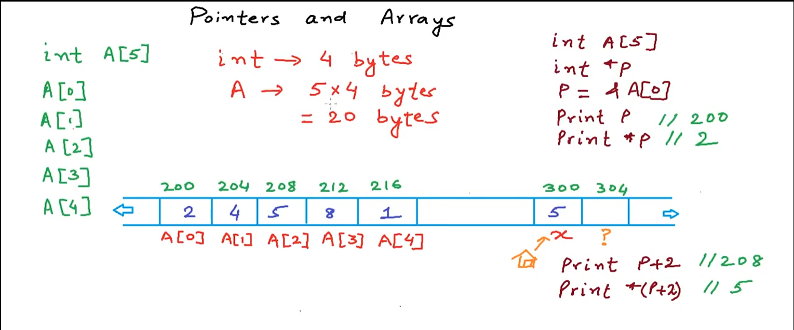

如代码第二行所示，使用`int *p = A`同样可以得到数组`A`的地址，也即`A[0]`的地址。

我们有以下重要结论：**`&A[i]` 与`A + i`等价， `A[i]`与`*(A+i)`等价**。

最后视频作者提供以下代码供复习，本文不过讲解。

```c
int A[] = {2,4,5,8,1};
int i;
int* p = A;
p++; // A++ is invalid
for (int i =0;i<5;i++){
    printf("%d\n", &A[i]);
    printf("%d\n", A+i);
    printf("%d\n", A[i]);
    printf("%d\n", *(A+i));
}
```

*笔者注*：关于数组名`A`何时表示为指针，详细建议查阅**数组名退化**的概念，在后续介绍函数指针中同样涉及**函数名退化**的概念。

## 第七节：数组作为函数参数
### 错误示例
如何将数组作为函数参数呢？考虑如下代码:

```c
#include<stdio.h>
int SumOfElement(int A[]){
   int i, sum = 0;
   int size = sizeof(A) / sizeof(A[0]);
   for (i = 0;i< size;i++){
       sum+= A[i];
   } 
   return sum;
}
int main(){
    int A[] = {1,2,3,4,5};
    int total = SumOfElement(A);
    printf("%d\n", total);
}
```

我们设计了函数`SumOfElement`，函数计算数组内元素的和。对代码进行测试，输出`total`却是1而并不是想要得到的15。视频作者给出了如下解释。

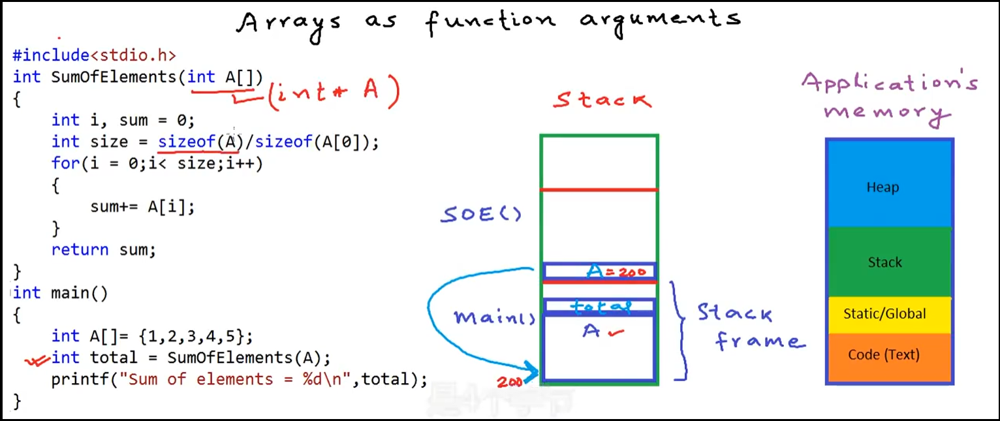

如上图所示。在内存模型中，`main`函数的栈帧中存放有数组`A[5]`以及变量`total`，在调用函数`SumOfElement`中，实际被传入的是数组`A[5]`第一个元素的指针，即在函数签名中的`int A[]`等价于`int *A`，即该种传参方式为指针传递而非按值传递，因此我们可以在被调函数中修改`main`函数中的数组`A[5]`。我们可以想象如果数组很大时，每次传参都整体复制一次是一种很大的浪费。

### 正确示例
那么我们该如何实现对数组元素求和的函数呢？如下所示，我们需要提前计算数组的大小，并将该参数传入被调函数`SumOfElement`：

```c
#include<stdio.h>
int SumOfElement(int A[], int size){
   int i, sum = 0;
   for (i = 0;i< size;i++){
       sum+= A[i];
   } 
   return sum;
}
int main(){
    int A[] = {1,2,3,4,5};
    int size = sizeof(A) / sizeof(A[0]);
    int total = SumOfElement(A, size);
    printf("%d\n", total);
}
```

*笔者注*：C/C++的数组在高效存储的同时在使用和理解中的确有诸多不便，有时不妨使用STL中array或vector等容器。注意此时在`main`函数中，`sizeof(A)`中`A`并没有退化为指针。

## 第八节：指针与字符数组（上）
### 字符数组的存储和访问
字符数组或者说字符串是一种特殊的数组类型。比如存放"John"时，如下图所示，我们理所当然可以将每一个字符作为一个字节塞进一段字符数组。但是该如何判断字符串结尾呢？在C语言中，使用在字符串结尾中加入"\0"作为字符串结束的标志位。因此"John"需要5个字节存放。

`printf`函数同样以"\0"作为字符串结束的标志位，如使用`A[4]`存放"John"，数组中未放入"\0"，则`printf`将打印完"John"后不会停止，一直打印直到碰到下一个`'\0'`，因此会导致输出乱码；如果使用`A[20]`存放"John"，数组中放入"\0"，则`printf`打印完"John"即停止。

*笔者注*：可以对比上一节中的`SumOfElement`函数，在未传递数组大小时，`printf`函数无法通过指针直接判断输出该何时停止。

使用`strlen`函数返回数组内字符串的大小（不包括结尾`'\0'`），同样其计算结果与数组大小无关（需提前`#include<string.h>`），如下代码：

```c
char C[] = "John"; 
//char C[4] = "John" is invalid, char C[]={'J', 'o', 'h', 'n', '\0'} is valid.
printf("%d\n", sizeof(C)); // 5
printf("%d\n", strlen(C)); // 4
```

注意代码第二行，初始化字符数组的一种错误和另一种正确方式。

### 指针与数组的不同

```c
char c1[] = "hello";
char* c2;
c2 = c1; 
// c1 = c2; is invalid
```

如上代码所示，将`c1`赋值给`c2`是正确的，此时`c1`退化为指针，但是将`c2`赋值给`c1`是错误的。

## 第九节：指针与字符数组（下）
如下代码，视频作者提到此时字符串"Hello"是被放在代码区的常量，可以视为一个地址，因此可以赋值给`char*`类型的指针，但是无法修改通过指针直接修改。

```c
char* C = "Hello";
// C[0] = 'a'; is invalid
```

*笔者注*："Hello"是字符串常量，是不能修改的，因此当声明一个指针指向该字符串常量时，同样不能通过指针的方式进行修改，因此写作`const char* C = "Hello"`更为合适（C++中必须写成该方式）。视频作者并未完整介绍指针常量与常量指针，这也是经常容易弄混的概念。同时注意，此与`char C[] = "Hello"`是不同的，此表示会复制一份"Hello"至数组`C[6]`。

## 第十节：指针和二维数组
见如下代码：

```c
int B[2][3] = {2,3,6,4,5,8};
int (*p)[3] = B; // int* p = B is invalid
printf("%d\n,%d\n", B, &B[0]); //400
printf("%d\n,%d\n,%d\n", *B, B[0], &B[0][0]); // 400
printf("%d\n,%d\n", B+1, &B[1]); // 412
printf("%d\n,%d\n,%d\n", *(B+1), B[1], &B[1][0]); // 412
printf("%d\n,%d\n,%d\n", *(B+1)+2, B[1]+2, &B[1][2]); // 420
printf("%d\n", *(*B+1)); //3
```

首先二维数组在内存中的存储方式如下图所示，在内存中也是顺序存储的：

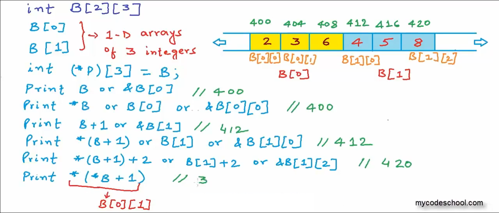

数组`B[2][3]`可以看作是由两个一维数组`B[0]`和`B[1]`组成，因此代码第二行的右值，可以看作是`B`的第一个元素的地址，但是请注意`B`的第一个元素是一个一维数组，因此数组指针的初始化如第二行所示。

*笔者注*：数组指针和指针数组也是需要区分的概念，这里不再介绍。

接下来对以下六个`printf`函数进行解释。代码第三行，`B`、`&B[0]`是等价的，理解为`B`第一个元素的地址，输出结果为400；代码第四行，`*B`、`B[0]`、`&B[0][0]`是等价的，理解为`B`第一个元素里面第一个元素的地址，输出结果为400；代码第五行，`B+1`、`&B[1]`是等价的，理解为`B`第二个元素的地址，输出结果为412；代码第六行，`*(B+1)`、`B[1]`、`&B[1][0]`是等价的，理解为`B`第二个元素第一个元素的地址，输出结果为412；代码第七行，`*(B+1)+2`、`B[1]+2`、`&B[1][2]`是等价的，理解为`B`第二个元素里第三个元素的地址，输出结果为420；代码第八行，`*(*B+1)`理解为`B`第一个元素里的第二个元素地址解引用，输出结果为3。

最后视频作者提到`B[i][j]`、`*(B[i]+j)`、`*(*(B+i)+j)`三者是等价的。

*笔者注*：二维数组与二级指针类似，想要获取地址里面的数值，必须要使用两个解引用*符号。不过确实多层嵌套指针加上多种表示方式导致其不容易理解。

## 第十一节：指针和多维数组

更多维数组是类似的，如下代码所示：

```c
int C[3][2][2] = {2, 5, 7, 9, 3, 4, 6, 1, 0, 8, 11, 13};
int (*p)[2][2] = C;
int (*p1)[2] = C[0];
printf("%d\n", C); // 800
printf("%d,%d,%d\n", *C, C[0], &C[0][0]); //800
printf("%d,%d\n", *(C[0][1] + 1), C[0][1][1]); //9
printf("%d,%d,%d\n", *(C[1]+1), C[1][1], &C[1][1][0]); //824
```

需要注意指针变量`p`和`p1`的类型的书写格式。

对于三维数组，实际上在内存中也是顺序存储的。如下图所示：

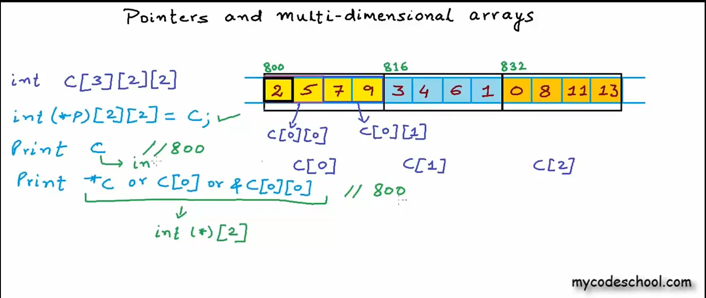

可以认为数组`C`由`C[0]`、`C[1]`、`C[2]`三个二维数组组成，`C[0]`由`C[0][0]`和`C[0][1]`两个一维数组组成，以此类推。

代码中`printf`函数的输出本文不再解释。后续视频作者提到`C[i][j][k]`、`*(C[i][j]+k)`、`*(*(C[i]+j)+k)`、`*(*(*(C+i)+j)+k)`四者都是等价的。

### 多维数组作为函数参数
将多维数组作为参数，如下例所示，`Func1`、`Func2`、`Func3`三个函数分别将一维、二维、三维数组作为参数，参数类型可以用后面注释代码替换。

```c
#include<stdio.h>
void Func1(int A[]){} // int* A
void Func2(int A[][3]){} // int (*A)[3]
void Func3(int A[][2][2]){} // int (*A)[2][2]
int main(){
    int A[2] = {1, 2};
    Func1(A);
    int B[2][3] = {2, 4, 5, 6, 7, 8};
    Func2(B);
    int C[3][2][2] = {2, 5, 7, 9, 3, 4, 6, 1, 0, 8, 11, 13};
    Func3(C);
}
```

## 第十二节：指针和动态内存-栈vs堆
### 栈区
本节视频作者简单介绍了栈和堆的使用和区别。如图所示：

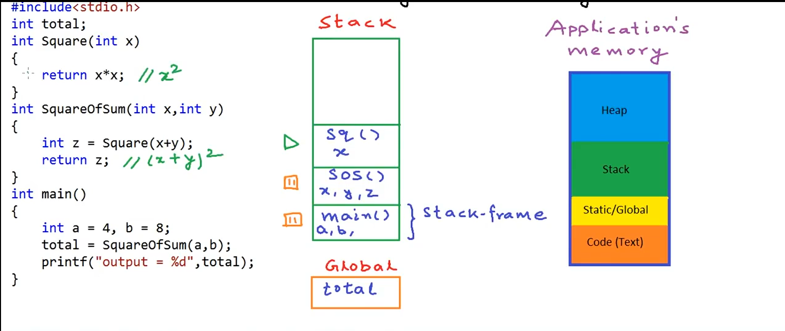

对于图中左侧代码，在入口`main`函数中可以看到，程序后续依次调用了`SquaerOfSum`和`Square`函数，在内存模型中，函数的局部变量是放在栈区的，由系统自动管理内存申请和释放。对于该代码，在栈中依次压入`main`、`SquaerOfSum`、`Square`三个函数的栈帧，当函数执行完毕后反向依`Square`、`SquaerOfSum`、`main`释放掉，其表现与数据结构中的栈先进后出的规则是一致的（堆区则与数据结构中的堆是不一样的）。当栈帧过多或者局部变量过大时，由于栈区大小是在程序运行时就已经固定的，因此可能造成栈区使用耗尽，发生栈溢出(stack overflow)。

### 堆区
那么如何申请大内存呢？我们需要使用到堆区，堆区的内存在程序运行时往往不是固定大小的，但是需要手动申请和释放内存空间。在C中可以使用`malloc`和`free`函数来手动申请或释放内存。如下代码：

```c
#include<stdio.h>
#include<stdlib.h>
int main(){
    int a;
    int* p;
    p = (int*)malloc(sizeof(int));
    *p = 10;
    free(p);
    p = (int*)(20*sizeof(int));
    free(p);
}
```

结合下图中内存模型，首先在栈中申请了变量`a`和变量`p`，使用`malloc`函数在堆区分配`sizeof(int)`数量字节的内存，因为`malloc`函数返回的指针类型是`void*`，需要强制转换为`int*`并赋值给`p`，（注意当无法申请到足够数量的内存时`malloc`函数将返回NULL，严格意义上需要判断），堆区内存需要手动释放，因此在`p`指向另一个地址前需要使用`free`函数释放掉。代码第九行在堆区申请了`20*sizeof(int)`字节的内存，即数组，我们可以通过`*p`、`p[0]`等数组的方式使用。


在C++中使用`new`和`delete`管理堆区内存，使用如下:

```c++
int* p = new int(10);
delete p;
p = new int[20];
delete[] p; //delete p is right in this case
```

*笔者注*：C++改进了C中对堆区的管理，整体较为简单。本文对栈、堆的介绍较为简单，建议阅读更多资料更深入去了解程序内存模型。

## 第十三节：指针和动态内存 - malloc、calloc、relloc、free
`malloc`函数的使用如下所示。这里提示直接写想要申请的字节数量并不是一个很好的习惯：

```c
int* p = (int*)malloc(3 * sizeof(int));
```

`calloc`函数的使用如下所示，需要输入两个参数，分别为数量和单个类型大小。与`malloc`不同的是，`calloc`会把申请的内存全部初始化为0，而通过`malloc`申请的内存并不会初始化：

```c
int* p = (int*)calloc(3, sizeof(int));
```

`realloc`的函数如下所示，表示重新分配指针`p`（`p`须指向堆区内存）所指堆区内存的大小，如果申请新的内存能在原有基础上找到足够大小的连续内存，则会在原位置扩展，如果申请的内存过大，则将已有内存内存储的数值一起拷贝至一个新的内存位置。重新分配完内存后，此时再次使用`p`是危险的。
代码第二行，如申请的内存大小为0，与`free`等价；代码第三行，如果传入指针为`NULL`，则与`malloc`等价。

```c
int* p1 = (int*)realloc(p, 3 * sizeof(int));
int* p2 = (int*)realloc(p1, 0); // free(p1)
int* p3 = (int*)realloc(NULL, sizeof(int)); // (int*)malloc(sizeof(int))
```

强调，当通过指针`p`释放掉（`free(p)`）堆区内存后，还可以通过指针`p`访问该段内存，但这是十分危险的。

## 第十四节：指针和动态内存 - 内存泄漏
考虑如下代码（相比视频中代码有精简）：

```c
#include<stdio.h>
#include<stdlib.h>
void Play(){
    char* C=(char*)malloc(3 * sizeof(char))
}
int main(){
    while (1) {
        Play();
    }
}
```

在运行代码时会发现，程序所占用内存随时间在急速增加，原因则是未使用`free`函数释放堆区内存。当调用函数`Play`时，在堆区申请3个字节的内存，并使用指针`p`指向该段内存，当`Play`函数执行完毕返回至 `main`时，`Play`函数中的局部变量将被清除，但是堆区申请的内存并不会自动释放掉，也无法被再次使用，因此随着循环的执行，将有越来越多的堆区内存没有被释放，从而造成了内存泄漏。

*笔者注*：注意内存泄漏并不是指针`C`未释放，`C`是在栈区在`Play`函数结束后会自动释放，造成内存泄漏的是指针`C`指向的堆区内存没有被释放。

## 第十五节：函数返回指针
考虑如下代码：

```c
#include<stdio.h>
#include<stdlib.h>
void PrintHelloWorld() {
	printf("HelloWorld\n");
}
int* Add(int* a, int* b) {
	int c = (*a) + (*b);
	return &c;
}		   
int main() {
	int a = 2, b = 4;
	int* ptr = Add(&a, &b);
	// PrintHelloWorld();
	printf("%d\n", *ptr);
}
```

当运行该代码时，打印输出为6，将`main`函数中的`PrintHelloWorld`函数解注释时，打印输出不为6（因编译器不同，有可能也为6）.

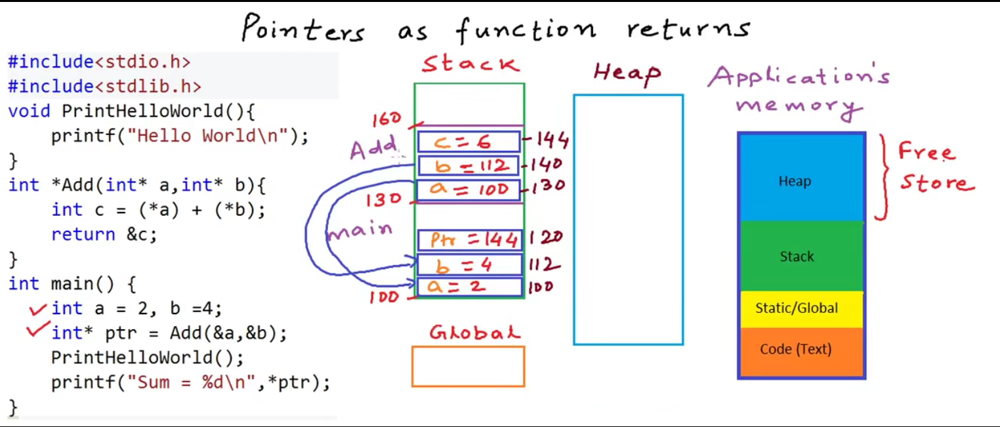

接下来视频作者解释了这个现象。如上图所示，在`main`中有`a`，`b`，`ptr`三个变量，当调用`Add`函数时，将`main`函数中的`&a`，`&b`传给`Add`函数中的局部变量`a`，`b`，因此在`Add`函数中的`a`存储`main`函数中`a`的地址100，`Add`函数中的`b`存储`main`中的`b`的地址112，最后`Add`函数返回局部变量`c`的地址144，并清除`Add`函数栈帧。当在`main`函数打印输出内存地址为144中存储的数值时，我们要清除此时该内存已经被系统自动释放，此时去解引用时，存储的数值可能已经发生了变化，比如将第十四行代码`PrintHelloWorld`函数解注释，当调用`PrintHelloWorld`即创建该函数的栈帧，内存地址`144`内存储的数值很可能被函数`PrintHelloWorld`修改了。因此无法再次得到想要的结果。

那么该如何实现返回指针的需求呢？可以考虑返回全局区或者堆区的指针，因为这些区域的内存并不会被系统自动释放掉。代码如下：
```c
#include<stdio.h>
#include<stdlib.h>
int* Add(int* a, int* b) {
	int* c = (int*)malloc(sizeof(int));
	*c = (*a) + (*b);
	return c;
}		   
int main() {
	int a = 2, b = 4;
	int* ptr = Add(&a, &b);
	printf("%d\n", *ptr);
	free(ptr);
}
```

*笔者注*：不要返回局部变量（栈区）的指针（地址）。

## 第十六节：函数指针

指针指向的是内存地址，而非必然是变量。指针也可以指向函数。

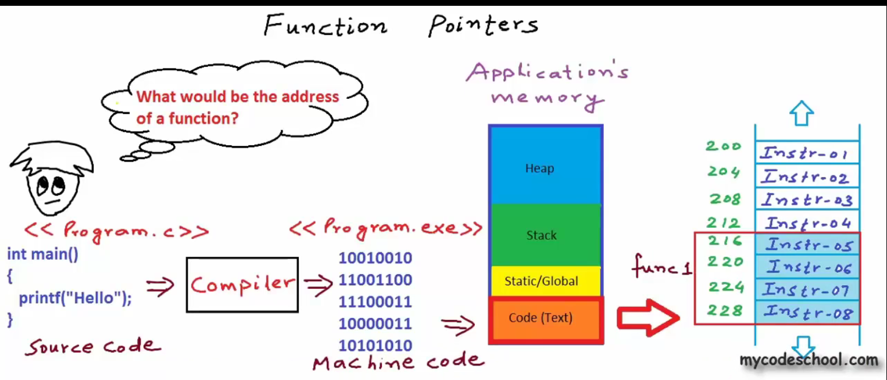

何为函数指针？如上图所示，当写完源代码如program.c后，编译器（compiler）最终会把编译成program.exe的可执行文件，文件内容为二进制的机器码。程序在调用函数时，会跳转(call指令)至代码区函数所在的起始位置，并逐行执行函数的机器码。因此函数在内存模型中也可以认为有地址的。

如何使用函数指针呢？如下代码所示：

```c
#include<stdio.h>
int Add(int a, int b) {
	return a + b;
 }
int main() {
	int c;
	int (*p)(int, int); // int* p(int, int)
	p = &Add; // p = Add
	c = (*p)(2, 3); // c = p(2, 3)
	printf("%d\n", c);
}
```

代码中，第七行定义了函数指针`p`，注意其与注释部分代码的区分，注释部分表示返回值为`int*`的函数的声明。代码第八行将函数`Add`赋值给指针`p`，其中符号&可以省略，如注释部分所示；代码第九行则通过指针`p`调用了`Add`函数，其中符号*可以省略，如注释部分所示。

*笔者注*：更多的时候我们使用typedef来使用函数指针，如下:

```c
typedef int (*ADD)(const int&, const int&);
ADD padd = Add;    
```

## 第十七节：函数指针的使用案例（回调函数）

回调函数是函数指针的简单应用，比如在相机SDK开发中通过回调获取图像。

```c
#include<stdio.h>
void A() {
	printf("Hello");
}
void B(void (*ptr)()) {
	ptr();
}
int main() {
	void (*p)() = A;
	B(p); // B(A)
}
```

回调函数的简单使用如上所示，即可以简单理解为，将函数`A`或指针`p`作为参数传给函数`B`，在函数`B`中回调函数`A`。

下面提供另一个更使用的例子，通过将比较方法传入`BubbleSort`函数，实现不同方式的排序。

```c
#include<stdio.h>
int compare(int a, int b) {
	if (a > b) return -1;
	else return 1;
}
int abosulte_compare(int a, int b) {
	if (abs(a) > abs(b)) return 1;
	return -1;
}
void BubbleSort(int* A, int n, int(*compare)(int, int)) {
	int i, j, temp;
	for (i = 0; i < n; i++) {
		for (j = 0; j < n - 1; j++) {
			if (compare(A[j], A[j + 1]) > 0) {
				temp = A[j];
				A[j] = A[j + 1];
				A[j + 1] = temp;
			}
	   }
	}
}
int main() {
	int i, A[] = { -31,22,-1,50,-6,4 };
	BubbleSort(A, 6, compare);
	for (i = 0; i < 6; i++) { printf("%d\n", A[i]); }
	BubbleSort(A, 6, abosulte_compare);
	for (i = 0; i < 6; i++) { printf("%d\n", A[i]); }
}
```

*笔者注*：如果熟悉C++的STL，该类函数指针被称为**二元谓词**。