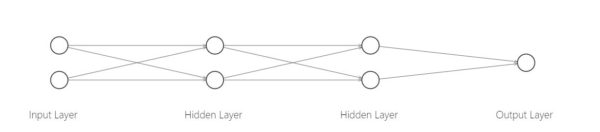

# 反向传播（BP）算法的一种简单理解

反向传播算法是神经网络中的经典算法，算法本身并不复杂，通过理解反向传播能够更深入的理解神经网络的工作方式。本文从一个化简$\frac{\partial C}{\partial w}$微分方程的思路，循序渐进地引出反向传播算法公式，注意这不是十分严格的数学推导。

当使用梯度下降法时，我们需要计算$\frac{\partial C}{\partial w}$，再根据

$$
w=w-\mathrm{\eta}\frac{\partial C}{\partial w}\tag{1}
$$

更新权重，其中$\mathrm{\eta}$为学习率。

而在反向传播算法中，更新$\frac{\partial C}{\partial w}$的计算复杂度为O(n)，可以通过一次正向传播和一次反向传播更新全部权重。

这里推荐[《深度学习之美》](https://zhuanlan.zhihu.com/p/44138371)，在众多的资源中，我认为其是形象基础的，本文也多受其启发。

## 符号介绍
因为众多的文章书籍并没有统一的符号规范，这里先对本文使用的符号进行规范，以免发生混淆：

| 符号                                   | 意义                                                      |
| -------------------------------------- | --------------------------------------------------------- |
| $L$                                    | 表示网络的总层数                                          |
| $𝑤_{𝑗,𝑘}^{𝑙}$                          | 表示第$l-1$层第$k$个神经元到第$l$层第$j$个神经元的权重$w$ |
| $b_{𝑗}^{𝑙}$                            | 表示第$l$层第$j$个神经元的偏置$b$                         |
| $a_{𝑗}^{𝑙}$                            | 表示第$l$层第$j$个神经元的激活值$a$                       |
| $z_{j}^{l}=𝑤_{𝑗}^{𝑙}a^{𝑙-1}+b_{𝑗}^{𝑙}$ | 表示第$l$层第$j$个神经元的带权输入$z$                     |
| $a_{𝑗}^{𝑙}=\sigma(z_{j}^{l})$          | $\sigma$表示sigmiod激活函数                               |
| $C$                                    | 代价函数                                                  |

<small>
精力有限，文章中未对向量、标量、矩阵的表示方式进行严格区分，通常只有上标没有下标的参数为向量。
</small>

## 拆解直接计算
本文以如下图的一个多层感知机（MLP）为例，为了使公式更加简洁，我们**省略偏置和激活函数**。

### 正向传播
我们首先需要回顾一下正向传播的过程，对于本文网络，最后一层的神经元的激活值为：

$$
a^{4}=𝑤^{4}\cdot(𝑤^{3}\cdot(𝑤^{2}\cdot a^{1}))\tag{2}
$$

其中$𝑤^{4}$，$𝑤^{3}$，$𝑤^{2}$分别为3-4层、2-3层、1-2层的权重矩阵（再次提醒已忽略偏置和激活函数）。以$𝑤^{3}$为例，其矩阵为：

$$
𝑤^{3}=
\left[
\begin{matrix}
𝑤_{1,1}^{3} & 𝑤_{1,2}^{3} \\
𝑤_{2,1}^{3} & 𝑤_{2,2}^{3}  \\
\end{matrix}
\right] \tag{3}
$$

当使用均方误差作为代价函数时：

$$
C=\frac{1}{2}||y-a_{1}^{4}||^{2}\tag{4}
$$

可以看到其本质就是一个复合函数。
### 直接计算梯度
在公式（2）中，矩阵乘法可以写为线性方程组，因此代价函数可表示为：

$$
C=f(𝑤_{1,1}^{1},𝑤_{1,2}^{1},...,𝑤_{1,2}^{4},𝑤_{2,2}^{4})\tag{5}
$$

即$C$可以表示为自变量只包括各权重的函数，因此最简单的办法是将其公式全部分解再计算。很显然当网络较大时，这种办法是不可行的。本节的目的主要是为了熟悉正向传播过程。
## 使用链式法则计算梯度

### 复合函数求导
在大学高数微积分中针对复合函数可以使用链式法则快速求解，有时也可以利用中间变量方便求导。
其基本公式为：

$$
\frac{\partial z}{\partial x}=\frac{\partial z}{\partial t}\cdot\frac{\partial t}{\partial x}\tag{6}
$$

我们可以使用该方法计算出：

$$
\frac{\partial C}{\partial 𝑤_{1,1}^{4}}=\frac{\partial C}{\partial a_{1}^{4}}\frac{\partial a_{1}^{4}}{\partial 𝑤_{1,1}^{4}}\tag{7}
$$

$$
\frac{\partial C}{\partial 𝑤_{1,1}^{3}}=\frac{\partial C}{\partial a_{1}^{4}}\frac{\partial a_{1}^{4}}{\partial a_{1}^{3}}\frac{\partial a_{1}^{3}}{\partial 𝑤_{1,1}^{3}}\tag{8}
$$

$$
\frac{\partial C}{\partial 𝑤_{2,1}^{3}}=\frac{\partial C}{\partial a_{1}^{4}}\frac{\partial a_{1}^{4}}{\partial a_{2}^{3}}\frac{\partial a_{2}^{3}}{\partial 𝑤_{1,1}^{3}}\tag{9}
$$

$$
\frac{\partial C}{\partial 𝑤_{1,2}^{3}}=\frac{\partial C}{\partial a_{1}^{4}}\frac{\partial a_{1}^{4}}{\partial a_{1}^{3}}\frac{\partial a_{1}^{3}}{\partial 𝑤_{1,2}^{3}}\tag{10}
$$

这使得我们不用将公式(2)全部分解为公式(5)也能计算部分梯度。
### 链式法则
然而有的时候选择合适的一个$t$是很难的，因为往往微分不是“单链的”，比如计算$\frac{\partial C}{\partial 𝑤_{1,1}^{2}}$：

$$
\frac{\partial C}{\partial 𝑤_{1,1}^{2}}=\frac{\partial C}{\partial a_{1}^{4}}\frac{\partial a_{1}^{4}}{\partial z_{1}^{4}}...\frac{\partial z_{1}^{4}}{\partial 𝑤_{1,1}^{2}}\tag{11}
$$

公式中的$...$该如何填写？这里我们需要扩充复合函数求导，本节主要摘选自Christopher Olah的[blog](http://colah.github.io/posts/2015-08-Backprop/)。

对于：

$$
c=a+b\\
d=b+1\\
e=c\times d\\\tag{12}
$$

我们可以生成如下图的图形化表示，该图称为计算图（Computational Graphs，是链式法则的一种图形化表示。

<Zoom>  </Zoom>

对于求解$\frac{\partial e}{\partial a}$，我们可以看到a只通过影响c最终影响e的结果，即只有一条a->c->e一条路径。因此：

$$
\frac{\partial e}{\partial a}=\frac{\partial e}{\partial c}\frac{\partial c}{\partial a}
$$

<small>使用“影响”这个词可能显得并不专业且较为抽象。</small>

对于求解$\frac{\partial e}{\partial b}$，我们可以看到b通过影响c和d两条路径最终影响e的结果，即包括b->c->e、b->d->e两条路径，并不是“单链的”，因此：

$$
\frac{\partial e}{\partial b}=\frac{\partial cd}{\partial b}=d\frac{\partial c}{\partial b}+c\frac{\partial d}{\partial b}=\frac{\partial e}{\partial c}\frac{\partial c}{\partial b}+\frac{\partial e}{\partial d}\frac{\partial d}{\partial b}
$$

我们可以将此求微分的方法总结为**同一条路径的节点相乘，最后将所有的路径相加**。

<small>
注意结点之间相乘是因为复合函数求导公式(6)，当使用中间变量时需要使用乘法。

所有路径相加是依据全微分公式，当有多个中间变量时需要使用加法。

路径的加法和乘法与公式(11)中各子式中的运算符号是无关的，公式中的加法和乘法只影响如$\frac{\partial e}{\partial c}$、$\frac{\partial c}{\partial a}$的求解，请注意区分。
</small>

### 使用链式法则计算梯度
根据链式法则我们现在可以求出$\frac{\partial C}{\partial 𝑤_{1,1}^{2}}$，可以看到$𝑤_{1,1}^{2}$有$a_{1}^{2}$->$a_{1}^{3}$->$a_{1}^{4}$和$a_{1}^{2}$->$a_{2}^{3}$->$a_{1}^{4}$两条路径，因此：

$$
\frac{\partial C}{\partial 𝑤_{1,1}^{2}}=
\frac{\partial C}{\partial a_{1}^{4}}\frac{\partial a_{1}^{4}}{\partial a_{1}^{3}}\frac{\partial a_{1}^{3}}{\partial a_{1}^{2}}\frac{\partial a_{1}^{2}}{\partial 𝑤_{1,1}^{2}}+
\frac{\partial C}{\partial a_{1}^{4}}\frac{\partial a_{1}^{4}}{\partial a_{2}^{3}}\frac{\partial a_{2}^{3}}{\partial a_{1}^{2}}\frac{\partial a_{1}^{2}}{\partial 𝑤_{1,1}^{2}}\\
=(\frac{\partial C}{\partial a_{1}^{4}}\frac{\partial a_{1}^{4}}{\partial a_{1}^{3}}\frac{\partial a_{1}^{3}}{\partial a_{1}^{2}}+\frac{\partial C}{\partial a_{1}^{4}}\frac{\partial a_{1}^{4}}{\partial a_{2}^{3}}\frac{\partial a_{2}^{3}}{\partial a_{1}^{2}})\frac{\partial a_{1}^{2}}{\partial 𝑤_{1,1}^{2}}\tag{12}
$$

## 反向传播二次简化梯度计算
到现在我们已经从简单粗暴的拆解直接计算，到使用链式法则简化计算。这距离反向传播只剩一步之遥了。
### 链式法则的问题
通过对比公式(7)、(8)、(9)、(10)、(11)我们可以发现，其中均有$\frac{\partial C}{\partial a_{1}^{4}}$一项，对比(8)、(10)、(11)，其中均有$\frac{\partial C}{\partial a_{1}^{4}}\frac{\partial a_{1}^{4}}{\partial a_{1}^{3}}$一项，公式(11)甚至可以化简。如果你把全部梯度写出，你就能发现更多的重复项。反向传播算法的强大之一就是避免了这些重复计算。
### 引入误差
这里我们引入误差这一概念，我们规定神经元的误差为(这里我们仍然忽略偏置和激活函数)：

$$
\delta_{j}^{l}=\frac{\partial C}{\partial a_{j}^{l}}\tag{13}
$$

可得：

$$
\frac{\partial C}{\partial 𝑤_{j,k}^{l}}=\frac{\partial C}{\partial a_{j}^{l}}\frac{\partial a_{j}^{l}}{\partial 𝑤_{j,k}^{l}}=\delta_{j}^{l}\frac{\partial a_{j}^{l}}{\partial 𝑤_{j,k}^{l}}\tag{14}
$$

即我们可以把对$\frac{\partial C}{\partial 𝑤_{j,k}^{l}}$的求解转化为对$\delta_{j}^{l}$的求解。那我们该如何求出所有$\delta_{j}^{l}$呢？我们先回到之前介绍的例子中。

首先，在神经网络中，根据$a_{j}^{l}=\sum_{k}w_{j,k}^{l}\cdot a_{k}^{l-1}$可得：

$$
\frac{\partial a_{j}^{l}}{\partial a_{k}^{l-1}}=𝑤_{𝑗,𝑘}^{𝑙}\tag{15}
$$

从公式（7）中可得：

$$
\delta_{1}^{4}=\frac{\partial C}{\partial a_{1}^{4}}\tag{16}
$$

从公式（8）中可得：

$$
\delta_{1}^{3}=\frac{\partial C}{\partial a_{1}^{4}}\frac{\partial a_{1}^{4}}{\partial a_{1}^{3}}=\delta_{1}^{4}\frac{\partial a_{1}^{4}}{\partial a_{1}^{3}}=\delta_{1}^{4}w_{1,1}^{4}\tag{17}
$$

从公式（12）中可得：

$$
\delta_{1}^{2}=(\frac{\partial C}{\partial a_{1}^{4}}\frac{\partial a_{1}^{4}}{\partial a_{1}^{3}})\frac{\partial a_{1}^{3}}{\partial a_{1}^{2}}+(\frac{\partial C}{\partial a_{1}^{4}}\frac{\partial a_{1}^{4}}{\partial a_{2}^{3}})\frac{\partial a_{2}^{3}}{\partial a_{1}^{2}}=\delta_{1}^{3}\frac{\partial a_{1}^{3}}{\partial a_{1}^{2}}+\delta_{2}^{3}\frac{\partial a_{2}^{3}}{\partial a_{1}^{2}}
=\delta_{1}^{3}w_{1,1}^{3}+\delta_{2}^{3}w_{2,1}^{3}\tag{18}
$$

我们可以粗略的归纳总结为，第l层的$\delta^{l}$都可以从第$l+1$层的$\delta^{l+1}$求得。因此我们可以从最后一层开始，从后往前求得所有$\delta_{j}^{l}$再最终求得$\frac{\partial C}{\partial 𝑤_{j,k}^{l}}$，这便是反向传播算法的大致求解过程。
### 矩阵表示
我们对公式（18）拓展为矩阵表示

$$
\left[\begin{matrix}\delta_{1}^{2} \\\delta_{2}^{2} \\\end{matrix}\right] 
=\left[\begin{matrix}\frac{\partial a_{1}^{3}}{\partial a_{1}^{2}} &\frac{\partial a_{2}^{3}}{\partial a_{1}^{2}}\\\frac{\partial a_{1}^{3}}{\partial a_{2}^{2}} &\frac{\partial a_{2}^{3}}{\partial a_{2}^{2}}\\\end{matrix}\right]\left[\begin{matrix}\delta_{1}^{3} \\\delta_{2}^{3} \\\end{matrix}\right]
=\left[\begin{matrix}w_{1,1}^{3} &w_{2,1}^{3}\\w_{1,2}^{3} &w_{2,2}^{3}\\\end{matrix}\right]\left[\begin{matrix}\delta_{1}^{3} \\\delta_{2}^{3} \\\end{matrix}\right]\tag{19}
$$

公式19中的2*2矩阵可以理解为向量$a^{2}$对向量$a^{3}$的一阶偏导，即[雅可比矩阵](https://zh.wikipedia.org/wiki/%E9%9B%85%E5%8F%AF%E6%AF%94%E7%9F%A9%E9%98%B5)的**转置**。因此只要计算每一层对应的雅可比矩阵（对于MLP来说，雅可比矩阵为每层的权重系数矩阵）。便可以使用矩阵快速计算每层误差$\delta_{j}^{l}$。
公式19可简化为：

$$
\delta^{2}=(w^{3})^{T}\cdot\delta^{3}\tag{20}
$$

## 反向传播算法介绍
这里我们加入偏置和激活函数，给出完整的反向传播算法（考虑偏置和激活函数，但未考虑正则项），该算法包括以下四个公式，摘自[《Neural Networks and Deep Learning》](http://neuralnetworksanddeeplearning.com/chap2.html):

$$
\delta^{L}=\nabla_{a}C\odot\sigma'(z^{L})\tag{BP1}
$$

$$
\delta^{l}=((w^{l+1})^{T}\delta^{l+1})\odot\sigma'(z^{l})\tag{BP2}
$$

$$
\frac{\partial C}{\partial b_{j}^{l}}=\delta_{j}^{l}\tag{BP3}
$$

$$
\frac{\partial C}{\partial 𝑤_{j,k}^{l}}=a_{k}^{l-1}\delta_{j}^{l}\tag{BP4}
$$

BP1和BP2中涉及到向量的计算，其中$\odot$表示哈达玛积。$\nabla_{a}C$表示输出$a$对损失$C$的梯度。$\sigma'$表示对激活函数求偏导。

反向传播算法的实现即首先计算BP1获得最后一层误差$\delta^{L}$，接下来从后往前根据BP2依次求出各层的$\delta^{l}$，最后根据公式BP3和BP4求出各层偏置和权重的梯度。

以下给出BP1和BP2两个公式的标量表示，便于理解：

$$
\delta_{j}^{L}=\frac{\partial C}{\partial a_{j}^{L}}\frac{\partial a_{j}^{L}}{\partial z_{j}^{L}}\tag{BP1-2}
$$

$$
\delta_{j}^{l}=\sum_{q}(w_{q,j}^{l+1}\times\delta_{q}^{l+1})\frac{\partial a_{j}^{l}}{\partial z_{j}^{l}}\tag{BP2-2}
$$

公式BP2-2中$q$表示$l+1$层的$q$个神经元。

## 总结
从链式法则到链式法则再到BP算法，可能这种理解方式如Michael Nielsen在《Neural Networks and Deep Learning》中所写是比较“无趣的”。但是翻阅网络上的资料，不是过于抽象就是过于简陋，相比之下，这种启发式的理解，往往更深刻。