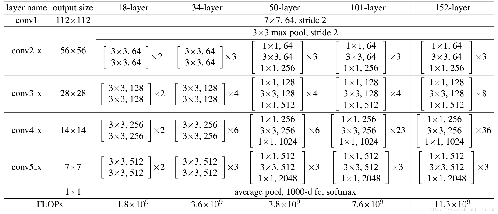

# Pytorch中Resnet的代码实现解析

本文介绍Pytorch对resnet的代码实现。文章从基本框架出发，由浅入深地再介绍部分细节设计，因此建议顺序阅读。

## 前言

Resnet是最著名的CNN网络之一，残差模型也在后续网络设计中有广泛的应用。本文主要解读Pytorch的torchvision == 0.11.1模块中对Resnet的代码实现。本文假设读者已经对CNN以及Resnet的结构有一定了解。

首先给大家推荐相关的优秀资源，[《pytorch中残差网络resnet的源码解读》](https://blog.csdn.net/u014453898/article/details/97115891)和李沐[Resnet论文精读](https://www.bilibili.com/video/BV1P3411y7nn?spm_id_from=333.999.0.0)。

## Resnet使用

直接使用Pytorch中的Resnet系列网络是很方便的，如下所示代码使用Resnet18。

```python
import torch
import torchvision

model = torchvision.models.resnet18(pretrained=True)
data = torch.rand(1, 3, 224, 224)
prediction = model(data)
```

我们“F12”直接进入函数的定义。首先我们可以看的在torchvision-models内包含大量已经实现的网络，除了Resnet、Vgg等图像分类网络，还包括Faster-rcnn、Ssd等目标检测网络，Deeplabv3语义分割网络等等。

## renset基本结构

在`resnet.py`文件内，我们可以看到共包含resnet18、resnet32等9个网络。这里我们只介绍原始论文中提到的5种网络的实现，即以下我们忽略`group`、`dilation`等相关一些参数。

我们可以看到当我们直接调用如resnet18时，首先会调用内置函数`_resnet`。在`_resnet`中,网络模型对象类型`model`则由`ResNet`类生成，在该类`forward`成员函数可以看到其网络结构，如下所示。
```python
x = self.conv1(x)
x = self.bn1(x)
x = self.relu(x)
x = self.maxpool(x)

x = self.layer1(x)
x = self.layer2(x)
x = self.layer3(x)
x = self.layer4(x)

x = self.avgpool(x)
x = torch.flatten(x, 1)
x = self.fc(x)

return x
```
可以看到网络依次为：7×7卷积层 - BN层（默认使用batch normalization）- 激活层 - 最大池化层 - 4个`layer`层-平均池化层 - 展平层 - 全连接层。

如下放入原始论文中网络结构表格（这个表格十分重要），conv2_x至conv5_x分别对应四个`layer`层。



在`ResNet`类中`__init__`魔术方法中还可以看到对卷积中`groups`、`dilate`、`norm_layer`层的自定义接口，以及一些特殊的参数初始化方法。这里不过多介绍。

## Resnet重要函数解析

以上介绍了Resnet系列网络的基本结构，下面我们针对其一些重要内部函数做详细的介绍，尤其是残差块的设计。

### `_resnet`函数

```python
_resnet('resnet18', BasicBlock, [2, 2, 2, 2], pretrained, progress, **kwargs)
_resnet('resnet34', BasicBlock, [3, 4, 6, 3], pretrained, progress, **kwargs)
_resnet('resnet50', Bottleneck, [3, 4, 6, 3], pretrained, progress, **kwargs)
_resnet('resnet101', Bottleneck, [3, 4, 23, 3], pretrained, progress, **kwargs)
_resnet('resnet152', Bottleneck, [3, 8, 36, 3], pretrained, progress, **kwargs)
```

以上列出5个Resnet系列网络在调用`_resnet`函数时的传入的参数。我们可以看到：

- resnet18和resnet34使用的是BasicBlock残差块，拥有较深层的50、101、152使用的是Bottleneck残差块。
- 第三个列表参量表示四个`layer`层中每一层中残差块的个数。

### `_make_layer`函数

```python
def _make_layer(self, block: Type[Union[BasicBlock, Bottleneck]], planes: int, blocks: int,
                    stride: int = 1, dilate: bool = False) -> nn.Sequential:
    norm_layer = self._norm_layer
    downsample = None
    previous_dilation = self.dilation
    if dilate:
        self.dilation *= stride
        stride = 1
    if stride != 1 or self.inplanes != planes * block.expansion:
        downsample = nn.Sequential(
            conv1x1(self.inplanes, planes * block.expansion, stride),
            norm_layer(planes * block.expansion),
        )

    layers = []
    layers.append(block(self.inplanes, planes, stride, downsample, self.groups,
                        self.base_width, previous_dilation, norm_layer))
    self.inplanes = planes * block.expansion
    for _ in range(1, blocks):
        layers.append(block(self.inplanes, planes, groups=self.groups,
                            base_width=self.base_width, dilation=self.dilation,
                            norm_layer=norm_layer))

    return nn.Sequential(*layers)
```

`_make_layer`函数的实现如上所示，作为网络中最重要的conv2_x至conv5_x的实现。我们首先关注其返回值是一个`layers`列表表示的网络序列。在`layers`中依次添加了对应数量的`block`，即BasicBlock或Bottleneck残差块，接下来我们来解析两种残差块。

同时我们可以发现`range(1, blocks)`，即第一个残差块与后面的残差块是不一样的,以及`block.expansion`、`downsample`等在后面进行解释。

### BasicBlock残差块
```python
def forward(self, x: Tensor) -> Tensor:
    identity = x

    out = self.conv1(x)
    out = self.bn1(out)
    out = self.relu(out)

    out = self.conv2(out)
    out = self.bn2(out)

    if self.downsample is not None:
        identity = self.downsample(x)

    out += identity
    out = self.relu(out)

    return out
```
`BasicBlock`类的`forward`函数如上所示，可以看到：
- 最重要的残差连接部分在实现上就是一个`+=`符号。
- `downsample`函数的目的是，当`out`与`identity`的`.shape`不一致时，需要对`identity`进行下采样，保持与`out`一致，以满足相加条件。

### Bottleneck残差块

```python
def forward(self, x: Tensor) -> Tensor:
    identity = x

    out = self.conv1(x)
    out = self.bn1(out)
    out = self.relu(out)

    out = self.conv2(out)
    out = self.bn2(out)
    out = self.relu(out)

    out = self.conv3(out)
    out = self.bn3(out)

    if self.downsample is not None:
        identity = self.downsample(x)

    out += identity
    out = self.relu(out)

    return out
```

我们可以清楚的看到`Bottleneck`与`BasicBlock`网络结构的差异，这里不做解释。

值得一提的是在`Bottleneck`中`expansion`值为4，`BasicBlock`中该值为1。该值代表了对于`Bottleneck`的第三个卷积层通道数增加了4倍。

### 再谈`_make_layer`函数

前面介绍了`downsample`函数的作用，那么何时该使用呢？我们回到`_make_layer`函数，看到添加`downsample`的判断语句：

```python
if stride != 1 or self.inplanes != planes * block.expansion:
```

即当`stride`不为1，即卷积层图像图小尺寸发生变化时，或者通道数发生变化时。这种变化只在`layer`层之间发生。具体地说：

- 何时stride不为1，即图像尺寸减半？在conv3_x（注意是自3起）至conv5_x每一个`layer`层的第一个残差块对图像尺寸进行减半，具体地说对于`BasicBlock`块是第一个残差块第一个卷积层，对于`Bottleneck`块是第一个残差块第二个卷积层。
- 何时通道数发生变化？每一个`layers`的通道数不一致，即输入到每一个`layers`的第一个残差块的张量的通道数和输入到第二个残差块的张量的通道数是不一样的。（注意对于`Bottleneck`块，虽然第三个卷积层通道数发生变化，但是在一个`layers`内，每一个残差块的输出与下一个残差块的输出是不变的）。
  
顺理成章的，我们也可以解释为什么`layers`列表分为两部分，因为在添加的第一个残差块需要传入了`stride`, `downsample`参量。

## 总结

以上既是对Pytorch中Resnet的网络代码实现的解析。对于Resnet网络来说，只通过文中的表格就能够基本上理解Resnet的结构。通过实现代码，可以更容易发现其不同深度的Resnet的区别和联系，以及一些代码实现细节。