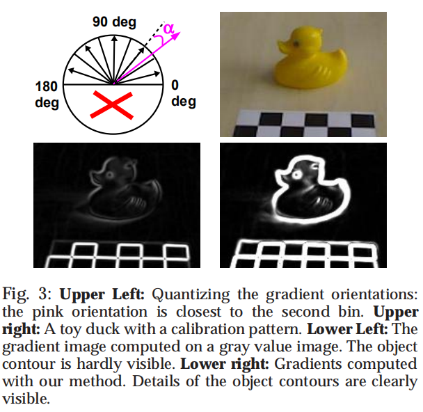
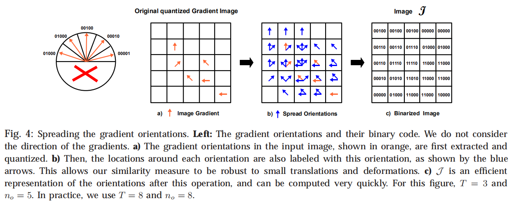
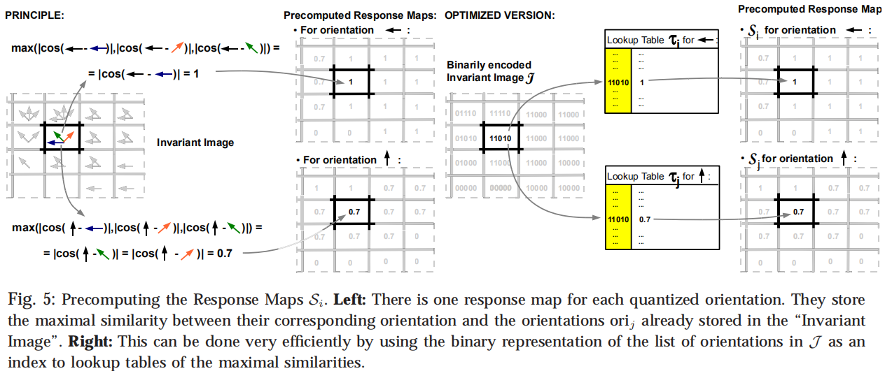
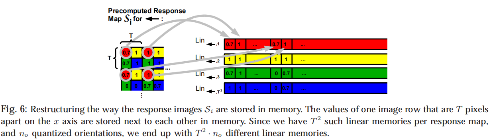
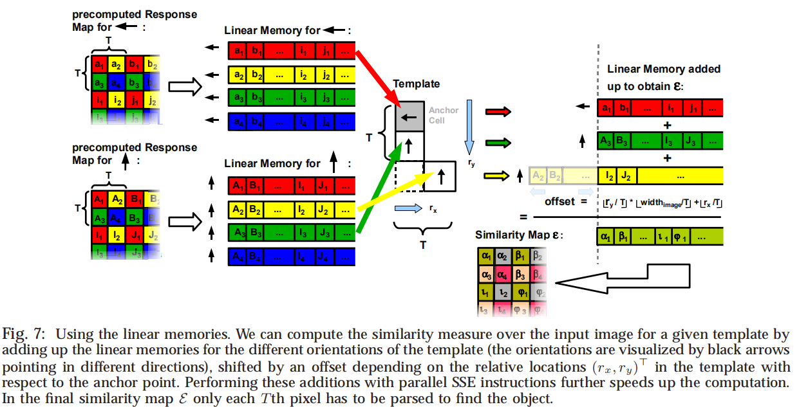

# 理解Linemod匹配算法

Linemod算法是一种基于形状的模板匹配算法，相较于历史工作，该算法通过量化梯度角度方法，利用现代计算机SIMD技术，实现更为快速的匹配。可以认为Linemod的主要工作是对原始形状匹配的加速。

本文将带大家介绍Linemod原论文《Gradient Response Maps for Real-TimeDetection of Texture-Less Objects》，尽全面的介绍该算法的实现细节。

从网络上找到的中文blog并不令人满意，最后还是花了不少时间阅读原文，也坚定了写这篇文章的动力。个人经历有限，关于论文“RELATED WORK”、“Extension to Dense Depth Sensors”及“Experimental Validation”等章节进行了忽略。

## 相关工作

首先了解前人的工作是很关键的，在原文中也有重点提及，即Steger于2002年提出的shape base matching算法。在Steger所著《机器视觉算法与应用》中亦有提及。Steger提出匹配相似度评价函数可以表示为：

$$
\epsilon_{Steger}(I,T,c)=\sum_{r\in P}\left| cos(ori(O,r)-ori(I,c+r))\right| \tag 1
$$

公式中$ori(O,r)$表示在模板图像$O$中位置为$r$的位置梯度的方向，$ori(I,c+r)$表示待测图像$I$中位置为$c$偏移为$r$位置的梯度的方向。cos表示取两个方向的差的余弦值。$T$则表示为模板，其中包括图像$O$本身和选取的待匹配的区域$P$。$P$的选择则是图像$O$中最具代表性的（most discriminant）的一些特征点。

为了减小轻微形变或噪声带来的影响，公式1优化为，在位置$c$处计算匹配相似度为其邻域$R(c+r)$内计算结果的最大值。公式表示为如下。

$$
\Epsilon_{Steger}(I,T,c)=\sum_{r\in P} (max_{t\in R(c+r)} \left|cos(ori(O,r)-ori(I,c+r))\right|) \tag 2
$$

其中

$$
R(c+r)=[c+r-\frac{T}{2},c+r+\frac{T}{2}]\times[c+r-\frac{T}{2},c+r+\frac{T}{2}] 
$$

可以看到在Steger的算法中，匹配只考虑梯度的方向，并不考虑梯度幅值大小。绝对值则表示忽略梯度方向正负号，即从图像明至暗和从暗至明计算的梯度方向是一致的。Steger对梯度幅值的恰当舍弃在Linemode中同样有使用，并对梯度方向做进一步简化。

## Linemod步骤

### 1. 计算图像梯度

首先计算图像梯度幅值和梯度方向，对于多通道图像，比如RGB彩色图像，原文中提出只取梯度幅值最大的通道的梯度方向。

### 2. 量化梯度方向（quantize orientation）

按照不同角度范围，将梯度方向量化为$n_{0}$个方向。该方法与Canny边缘提取算法中选择非极大值抑制的方向相似。量化梯度是Linemod一切优化的基础。

为了增加对噪声的宽容度，在量化后，对于每一个像素位置最终的梯度方向实际为$3\times3$邻域内统计梯度方向数量最多所对应的方向。

比如，在该像素$3\times3$范围内，统计方向$↑$数量为5个，方向$←$为2个，方向$→$为2个，则哪怕本身该像素的方向为$←$，也需要改为$↑$。

如原文中Fig.3所示：左上角图像，展示了当$n_{0}=5$时量化的方法，当计算梯度方向如粉色箭头所示时，它将量化为右数第二个范围内。对于右上角原始图像进行处理，左下角图像为直接求得的梯度幅值图像，可以看到图像边缘较弱，经过上文处理，结果图像如右下角所示，边缘变得非常清晰。

作为增加宽容度的代价，势必会影响匹配精度，因此邻域大小的选择需要根据实际成像质量而定。

### 3. 提取特征点

在上一章中只提到最具代表性的（most discriminant）的特征区域$P$。在文中只提到，选择的方法是只保留梯度幅值大于一定数值的点。

实际可以添加更多的条件，适当的减少特征点的数量以减少计算量加速匹配：如使用邻域非极大值抑制，控制特征点间的最小距离，保证选点尽量均匀。

### 4. 梯度扩展（Spreading the Orientations）

为了避免公式2的max操作，通过量化的梯度方向，只使用or操作便可以完成。具体方法如下。

如原文中Fig.4所示，左图表示量化梯度的一种表示方式，即使用二进制表示，二进制的每一位0或1表示一个方向的有无。即在梯度扩展前，在a图中，红色箭头表示提取的特征点的梯度方向，该图每一像素的梯度方向的二进制表示中只有一位的数值是1。b图表示当$T=3$时扩展后的梯度图，图中蓝色箭头表示将特征点邻域范围内梯度的方向扩展到了该点。c图表示扩展后的方向的二进制表示的图像$J$，在该图中像素的梯度方向的二进制表示中可能有多位的数值是1。

更具体的，我们以网格最中间的那个像素为例，解释梯度扩展。该点本身没有梯度方向，如b图中该点没有红色箭头，在该点$3\times3$的邻域范围内，共有4个不同的方向，因此该点有4个蓝色箭头。由于使用二进制的每一位数表示一个方向，因此使用一个二进制数“11110”便可表示该点扩展后的梯度方向。

注意：只对待匹配图像进行梯度扩展。

### 5. 计算响应图（Response Maps）

通过梯度扩展，我们将公式2中计算一个点邻域内所有位置的梯度方向相似度的最大值，转化为只计算该点扩展后的梯度方向相似度的最大值。

因为梯度是量化过的，当$n_{0}=5$时，扩展后的梯度的方向只有$2^{n_{0}}=32$种可能，因此可以使用查找表（lookup table）替代方向计算，以达到加速的目的。对于每一个方向，需要建立一个查找表，因此共需要$n_{0}=5$个查找表。

Fig.5中介绍了如何计算响应图。对于左图（PRINCIPLE）部分，对于图中$←$和$↑$两个方向，需要分别计算一次$max$。对于右图（OPTIMIZED VERSION），只需要提前建立Lookup Table $t_{j}$ for $←$和Lookup Table $t_{j}$ for $↑$ 两个查找表，即可通过查表获取结果。

对二进制图像$J$分别应用$n_{0}=5$个查找表，可以得到$n_{0}=5$张响应图$S_{i}$。

到目前，相对于Steger的方法，Linemod通过量化梯度方向，将$cos$+$max$操作转化为$quantize$+$lookup table$。

### 6. 线性化内存（Linearizing Memory）

最后，作者通过线性化响应图内存，加速最终匹配计算。将响应图线性化的方法如图Fig.6所示。

图中重点介绍了Line1的生成方法，即每隔$T$行$T$列取出$S_{i}$中对应数值组成Line1，因此共生成$T^{2}$个线性内存。对于$n_{0}=5$张响应图$S_{i}$，则共生成$T^{2}\times n_{0}$个线性内存。

### 7. 匹配计算

那么，线性化内存是如何加速计算的呢？以图Fig.7为例。

假设Template自待匹配图像的左上角开始顺序匹配，当Anchor Cell位于待匹配图像的左上角时:

此时对于Template中正好位于anchor处梯度方向为$←$的位置，取出Linear Memory for $←$ 中对应位置$[a_{1}b_{1}...i_{1}j_{1}]$那条线性内存，则此时该点的方向相似度值为$a_{1}$。

对于Template中位于anchor正下方处梯度方向为$↑$的位置取出Linear Memory for $↑$ 中对应位置$[A_{3}B_{3}...I_{3}J_{3}]$那条线性内存，则此时该点的方向相似度值为$A_{3}$。

对于对于Template中位于anchor斜下方处梯度方向为$↑$的位置取出Linear Memory for $↑$ 中对应位置$[A_{2}B_{2}...I_{2}J_{2}]$那条线性内存，主要注意对于该条线性内存，需要添加$offset=\lfloor r_{y}/T \rfloor \ast \lfloor width_{image}/T \rfloor+\lfloor r_{x}/T \rfloor$，此时该点的方向相似度值为$I_{2}$。

则最终，计算Template位于该位置处的总相似度$\alpha_{1}=a_{1}+A_{3}+I_{2}$。我们将排列好的线性内存组合全部对位相加，我们发现$\beta_{1}=b_{1}+B_{3}+J_{2}$，正好对应为将Template右移$T$个位置后，对应位置的总相似度，即我们一次性可以获取总的区域$P$中$\frac{1}{T^{2}}$的位置的匹配相似度，计算${T^{2}}$组不同的线性内存组合，最终生成相似度图像$\epsilon$。

得益于现代CPU的SIMD技术（文中的SSE指令集），这种对位的加法对于计算机是极快的。可以想象如果不进行线性化内存操作，对区域$P$中的每一个位置，Template中每一个像素通过查找$n_{0}=5$张响应图$S_{i}$，去计算求和，对计算机是较慢的，也就是文中提到的cache miss。

注意：该算法也同时要求待匹配图像的高、宽必须都是$T$的倍数。

## 总结

可以看到Linemod的作者，在Steger的shape base matching算法的基础上，即匹配相似度只考虑梯度方向，进行了合理的简化，通过量化梯度方向，并经梯度扩展、线性化内存等一系列操作，实现了对匹配的加速。
