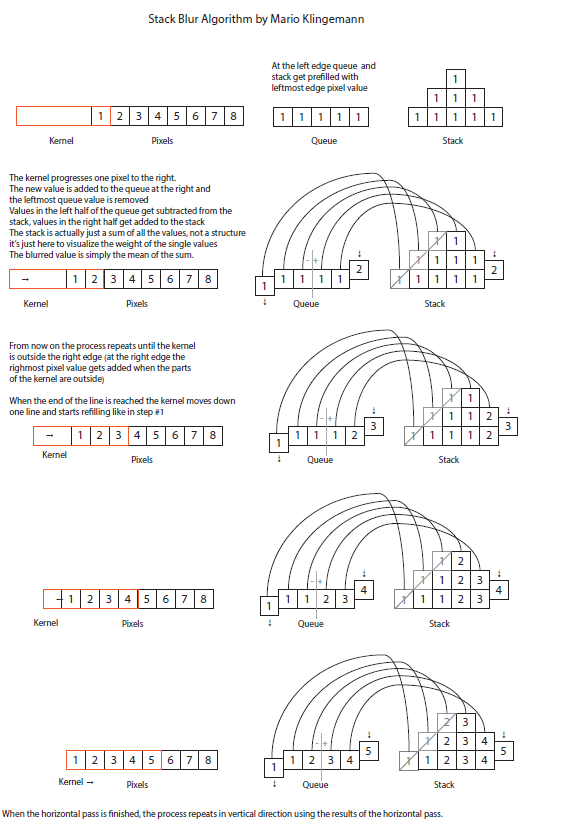

# 理解stackblur

最近闲看OpenCV4.7.0 milestone时发现，国人开发者zihaomu提交了一个`stackBlur`算子。该开发者描述该算子实现比均值滤波更好的效果的同时，满足耗时不随核大小变大而增大。一番搜索才发现自从2004年被发明至今已经很常用了，看来还沉浸在冈萨雷斯实在太old了。空闲时间对stackblur进行了理解，以作共享。

## 作者介绍

打开作者的[介绍文档](https://underdestruction.com/2004/02/25/stackblur-2004/)，直接摘抄了两段内容，可以先简单理解作者发明stackblur经历。

In 2004 I required a fast but still good looking image blur and did not find any existing solutions that fit both requirements. Either they were classical Gaussian blurs that resulted in perfectly smooth blurs at the price of slow processing time or they were simple box blurs that were reasonably fast but resulted in a blocky look. So I wrote my own blur algorithm which tries to be a compromise between the two:I called it Stack Blur because this describes best how this filter works internally: it creates a kind of moving stack (or maybe a “Tower of Hanoi” kind of structure) of colors whilst scanning through the image. This “tower” controls the weights of the single pixels within the convolution kernel and gives the pixel in the center the highest weight. The secret of the speed is that the algorithm just has to add one new pixel to the right side of the stack and at the same time remove the leftmost pixel. The remaining colors on the topmost layer of the stack are either added on or reduced by one, depending on if they are on the right or on the left side of the stack.

**翻译**：2004年我希望寻找到一个优秀的图像模糊方法，我希望现有的算法难以兼容（计算速度和模糊效果）两项优点：经典高斯滤波模糊效果很好但是计算速度较慢，简单的盒装滤波速度较好但还有blocky look（可以理解为边缘振铃效果）。所以我发明了一种新的能同时满足两项优点滤波算法：我称之为stackblur。这个名字的由来时因为这一描述能够很形象的描述该滤波器的工作机制：该滤波器创造了一个可移动的stack（或者一种类似汉诺塔的结构）遍历整个图像。这个stack结构控制像素在卷积核中的权重，其中卷积核中心的权重最高。速度快的原因在于该算法只需要在stack的右侧添加一个新的像素，同时移除最左侧的像素。对于stack最上面一层的像素，当该像素位于stack左侧时需要减一个，位于右侧需要加一个。

作者的文字其实还是难以理解，虽然我已经尽力翻译了，而且我觉得文字与图像描述有些不太一致。还好作者提供了一张示意图，以此为图像准理解起来就方便得多了。该图像共分为五行，模拟了卷积核从左至右的遍历过程。

当卷积核Kernel刚进入图像Pixcels时，首先将Queue和Stack全部设为第一个像素值1。当卷积核右移一位时，对于Queue，则需要减去最左侧的元素，再在右侧加入新的元素。对于Stack，则对于其中每一行减去该行最左侧的元素，再在右侧加上新的元素，这一操作相当于减去Queue中左侧一半的元素，再加上右侧一半元素。以此类推。

我们可以明显的发现stackblur的特点：

- 对于每一个像素，卷积核的权重是不一样的，中心的权重最高，边缘的权重最低，因此模糊效果优于均值滤波;
- 计算复杂度与stack高度相关，与卷积核大小无关。当stack高度为1时，其效果与均值滤波是一样的;
- stackblur相当于一种特殊卷积核的一种计算优化，图中所对应的卷积核为`[1,2,3,2,1]`。

后续待OpenCV4.7.0正式发布时，再有机会看看源码实现。
