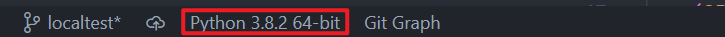
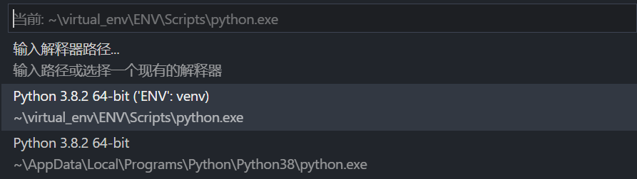

# 使用virtualenv配置Python虚拟环境

本文主要介绍使用virtualenv工具配置Python的虚拟环境和一些其他相关技巧，方便在以后的工作中迅速切换工作环境，优化工作流程。

在Python中，因为有pip工具的存在，我们不需要向c++一样手动导入千奇百怪的依赖库。但是在实际工作中往往遇到如下情况：比如最新的Opencv4.5.1中，对工作中常用的`minAreaRect`函数进行了更新，导致输出与以往不一致；再比如在一些历史项目中后台Microserver使用的c2v版本较老旧。因此，虚拟环境配置是一项实用的Python工程技能。

## 同名本地模块与全局模块切换

在介绍虚拟环境之前，先介绍另一个小技巧作为开胃菜：如何在本地模块和同名的全局模块之间切换。这在开发c2v库时是一个很迫切的需求。

首先我们需要了解Python对模块位置的搜索顺序，当你`import`一个模块时，Python解释器首先会去内置模块中搜索。当没有搜索到时，将在变量`sys.path`给出的目录中取搜索。

而`sys.path`将从如下位置依次搜索并初始化：

1. 当前目录。
2. 搜索环境变量`PYTHONPATH`下的每一个目录。
3. Python的安装目录，即我们通常通过pip安装的模块。

由上我们可以总结出调用本地模块的两种办法：
- 修改环境变量：将本地模块的路径添加到环境变量`PYTHONPATH`中，具体方法不再赘述。
- 动态增加路径：即直接修改sys.path变量。实例代码如下:
	```python
	import sys
	# 必须insert到开始位置，不可append
	local_lib_abspath=""
	sys.path.insert(0, local_lib_abspath)
	```

## virtualenv的安装和使用
Python中管理虚拟环境的工具有很多，比如内置的venv，新颖的pipenv等，你甚至可以尝试Anaconda，这里只介绍传统使用较多的virtualenv。它可以创建独立的Python解释器虚拟环境，你可以在里面单独部署第三方依赖包，每个虚拟环境和安装的Python环境是独立而且相互隔离的。以下从安装->部署->激活->关闭整理流程做一个介绍。
### 安装
虚拟环境的功能未集成在pip中，需要另外安装virtualenv工具，命令如下：
```shell
PS C:\Users\xzhang> pip install virtualenv
PS C:\Users\xzhang> virtualenv --version
virtualenv 20.4.3
```
### 部署一个新的虚拟环境
使用命令行工具输入如下命令，会在当前路径下自动创建一个`ENV`文件夹，该文件夹名即生成的虚拟环境名。

注意此时该环境默认是不包括全局环境中的第三方包的，我们也可以在`.\Lib\site-packages`下看到该环境下已经安装的模块。这也代表我们可以通过删除该文件夹销毁掉该虚拟环境，而不会对全局Python环境产生任何影响。
```shell
# 默认生成的虚拟环境不含全局模块
PS C:\Users\xzhang\virtual_env> virtualenv ENV
# 添加--system-site-packages，携带全局模块
PS C:\Users\xzhang> virtualenv --system-site-packages ENV2
```
需要注意当我们使用--system-site-packages生成虚拟环境时，并不会将全局环境的模块拷贝至虚拟环境，而是提供一个入口，原文注释是：give the virtual environment access to the system site-packages dir (default: False)。

经过测试有以下两点注意：
- 在虚拟环境中，无法修改、删除全局模块。
- 在虚拟环境中，可以安装与全局模块同名模块的不同版本，在虚拟环境中优先使用虚拟环境内的版本，

### 激活虚拟环境
输入如下命令，将激活该虚拟环境，注意此时在命令行开头出现了`(ENV)`。此时表示当前工作在名为`ENV`的虚拟环境中。
```shell
PS C:\Users\xzhang\virtual_env> ENV\Scripts\activate
(ENV) PS C:\Users\xzhang\virtual_env>
```
之后，我们可以通过`pip list`查看该虚拟环境中的模块，通过`python xxx.py`在虚拟环境中运行py文件。
### 关闭虚拟环境
输入如下命令，将关闭虚拟环境。
```shell
(ENV) PS C:\Users\xzhang\virtual_env> deactivate
PS C:\Users\xzhang\virtual_env>
```
可以看到原来命令行开头`(ENV) `消失了，另外当我们关闭命令行窗口时，即表示退出该虚拟环境。也就是说只有当前命令行程序在使用该Python虚拟环境，我们可以同时运行在多个虚拟环境中而互不干扰。
### vscode中虚拟环境的使用
在工作中，我们往往直接使用VSCode运行和调试Python，目前最新版VSCode也是支持虚拟环境配置的。步骤如下：
1. 在`setting`中搜索`python::virtual`，在 `Venv Path`中输入虚拟环境所在文件夹的绝对路径，在 `Venv Folders`中添加虚拟环境名（即虚拟环境文件夹名），具体操作如下图。
   
   

2. 点击VSCode底部`Status Bar`的`Python(Extension)`按钮。
   
   

3. 在顶部弹出的窗口中选择你要使用的虚拟环境。
   
   

这时，当你打开一个`powershell`终端，你可以看到开头出现了`(ENV)`之类字样，证明当前正运行在`ENV`虚拟环境中。

## 模块导出与导入
前面说到默认新建的虚拟环境第三方模块是空的，那么模块的备份管理的需求同样是迫切的。以下介绍如何导入和导出模块包。
### 模块导出
输入如下命令，将在当前路径下生成一个`requirements.txt`文件，该文件内保存**当前环境**的所有第三方依赖包。
```shell
PS C:\Users\xzhang> pip freeze > requirements.txt
```
### 模块导入
输入如下命令，将当前路径下`requirements.txt`文件中的模块包安装至**当前环境**。
```shell
PS C:\Users\xzhang> pip install -r requirements.txt
```
## 工作流程优化建议
我们知道当我们通过`sirius-cli`工具新建一个算法时，会产生一个`requirements.txt`文件来保存**后台Python工作环境**。我们可以充分利用并完善这个文件，针对每一个项目建立独立的Python工作环境，优化我们的工作流程。